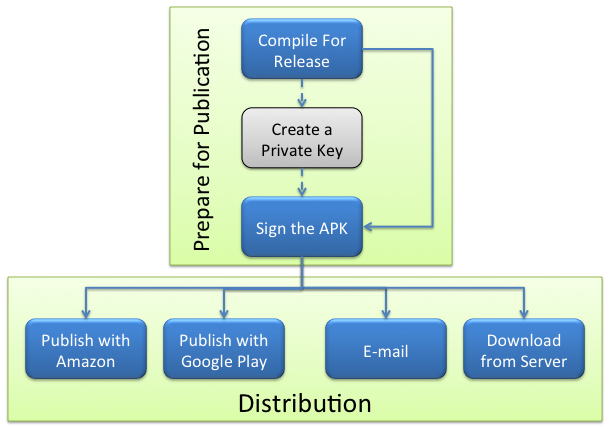

# <a href="https://docs.microsoft.com/en-us/xamarin/android/deploy-test/publishing/" >Publishing an Android Application </a>

## Android Application
1.  the steps involved with the public distribution of an application created with Xamarin.Android are : 
*  publish the application
 + Publishing is the process of compiling a Xamarin.Android application so that it is ready for users to install on their devices, and 
 + it involves two essential tasks:
  1. **Preparing for Publication** 
   +  A release version of the application is created
  2. **Distribution** 
   +  The release version of an application is made available any one distribution channels.
   +  channels such as e-mail, a private web server, Google Play, or the Amazon App Store for Android.
   +  Publishing to Google Play



### 1. **Preparing an Application for Release** <a href="https://docs.microsoft.com/en-us/xamarin/android/deploy-test/release-prep/?tabs=windows"> </a>
 + this steps start ,After an application has been coded and tested
 + in which we prepare a package for distribution
 1.  first step is to  build the application for release to get package ,
  + for this we need to be setting some application attributes :
  1. **Specify the Application Icon**
   + strongly recommended that each Xamarin.Android application specifies an application icon,   Google Play does not allow to publish , without  it.
   + it can be set in Android Manifest -> App Icon
   + it can also be set in Properties\AssemblyInfo.cs
   ```c#
     [assembly: Application(Icon = "@drawable/icon")]
   ```

  2. **Version the Application**
   + initializing or updating the versioning information.
   + so user aware of the version of app
   + it is important for application maintenance and distribution.
   + To assist with versioning, Android recognizes two different types of information:
   1. ***Version Number***
   + An integer value (used internally) that represents the version of the application
   + stored in AndroidManifest.xml file as android:versionCode.
   2. ***Version Name*** 
    + A string used to inform user or Google Paly about version of app,not used internally.
    +  stored in the AndroidManifest.xml file as android:versionName.
  3. **Shrink the APK** 
   + The size of the final APK can be substantially reduced by using combination of both, in same order: 
   1. ***Xamarin.Android linker***
   + which removes unnecessary managed code
    +  optimize the app at the managed code level
  * Configure the linker 
    +   Release mode turns off the shared runtime and turns on linking,to ship[ only required code .
     +    linker uses static analysis to determine which assemblies, types, and type members are used or referenced and discards the rest.
     +    linker provides 3 options : 
      1. None : Linker turned off 
      2. SDK Assemblies only : link assemblies required by X.Android(i.e static analysis of only these files)
      3. Sdk and User Assemblies: 
      + link all assemblies  required by app. 
   2.  ***ProGuard tool from the Android SDK*** 
 + ProGuard  is a Java class file shrinker, optimizer, and pre-verifier. It detects and removes unused code, analyzes and optimizes bytecode.
    + It reads input jars shrinks, optimizes, and pre-verifies them and then write result to output jar
    + step to process input jar are Shrinking step,Optimization step ,Obfuscation step,Preverification step
    + ProGuard is disabled by default.
    +  The Enable ProGuard option is available only when the project is set to Release mode
   + Xamarin.Android ProGuard configuration does not obfuscate the APK,for this need Dotfuscator.
  4.  **Protect the Application**
   +  Prevent users or attackers from debugging, tampering, or reverse engineering the application by
   1.   ***Disable Debugging***
 + in app development,debugging is performed with the use of the Java Debug Wire Protocol (JDWP).
    +  JDWP can pose a security issue for released applications.
    +  so, Always disable the debug state, in released app
    +  it can be done using :
    1.  android:debuggable attribute in Android Manifest set to false
    2. adding a conditional compile statement in AssemblyInfo.cs:
    ```c#
     #if DEBUG
     [assembly: Application(Debuggable=true)]
       #else
      [assembly: Application(Debuggable=false)]
     #endif
    ```            
  3.    **Obfuscating the managed code**
   +  ***Dotfuscator Community Edition*** (CE) can be used to obfuscate managed code and 
   +  inject runtime security state detection code into a Xamarin.Android app at build time to detect and respond if the app is running on a rooted device.
   +  it is done as Even with debugging disabled, it is still possible for attackers  to tamper with application.
   +  To use Dotfuscator,
   >  click Tools > PreEmptive Protection - Dotfuscator. 
  4. **Bundle Assemblies into Native Code**
   +  When this option is enabled, assemblies are bundled into a native shared library.
   +  allows assemblies to be compressed, permitting smaller .apk files
   +  This option requires an Enterprise license 
   +  this does not mean that the assemblies are compiled into native code. as not possible to use AOT Compilation .
  5.  **AOT Compilation**
   + this option (on the Packaging Properties page) enables Ahead-of-Time (AOT) compilation of assemblies
   + it reduces JIT startup overhead by precompiling assemblies.
   + it result shorter app startup time but large APK size
  6.  **LLVM Optimizing Compiler**
   + LLVM Optimizing Compiler will create smaller and faster compiled code and convert AOT-compiled assemblies into native code, 
   + but at the expense of slower build times. 
  + need AOT Compilation enabled.


  5.  **Set Packaging Properties**
   + Packaging properties control the creation of the Android application package (APK).
   + Packaging properties can be set in the Android Options section of project Properties
   +  Use Shared Runtime, and Use Fast Deployment are intended for Debug mode
   + this step, optimizes the APK, protects its assets, and modularizes the packaging as needed
   + can provide your users with an Android App Bundle that's optimized for their devices.
   + it does
   1. **Specify Supported Architectures**
   + you explicitly select an architecture (or architectures) when your app is configured for Release. 
     + Under the Android Options-> Packaging properties -> Advanced ->  Supported architectures
     + supported arch from old to new are armeabi(not supported from Android 9.2) ,armeabi-v7a (default for app),arm64-v8a,x86,x86_64 
     + based on target we must select arch. like deploy app to an x86 device, select x86.
     + We can use the Generate one package (.apk) per selected ABI option i.e target multiple arch.
 2. **Generate One Package (.APK) per Selected ABI**
     + When this option is enabled, one APK will be created for each of the supported ABI's(Arch binary interface)
 3.  **Multi-Dex**
     + When the Enable Multi-Dex option is enabled, Android SDK tools are used to bypass the 65K method limit of the .dex file format. 
     + The 65K method limitation is based on the number of Java methods that an app references
     +  The best practice is to enable Enable Multi-Dex only if absolutely necessary, i.e.the app still references more than 65K Java methods even after using ProGuard.
  4.  **Android App Bundles**
   +  it's a format that is intended to be uploaded with all of your compiled code and resources.
   +   After you upload your signed app bundle, Google Play will have everything it needs to build and sign your application's APKs and serve them to your users using Dynamic Delivery.
   +   We can now generate an app bundle by following the Archive Flow.
    
 

  6. **Compile** 
   +  This step compiles the code and assets to verify that it builds in Release mode.
   +   After all of the above steps are completed, the app is ready for compilation.
   +    Select Build > Rebuild Solution to verify that it builds successfully in Release mode.
   +     Note that this step does not yet produce an APK.


  7. **Archive for Publishing** 
  +  This step builds the app and places it in an archive for signing and publishing.
  * <a href="https://docs.microsoft.com/en-us/xamarin/android/deploy-test/signing/?tabs=windows"> Signing the Android Application Package</a>
  1.  begin the publishing process can be done in two ways
   +  right-click the project in Solution Explorer and select the Archive... context menu item
   +  right-click the Solution in the Solution Explorer and select Archive All.

  ### <a href="https://docs.microsoft.com/en-us/xamarin/android/deploy-test/publishing/publishing-to-google-play/?tabs=windows"> Publishing to Google Play</a>


