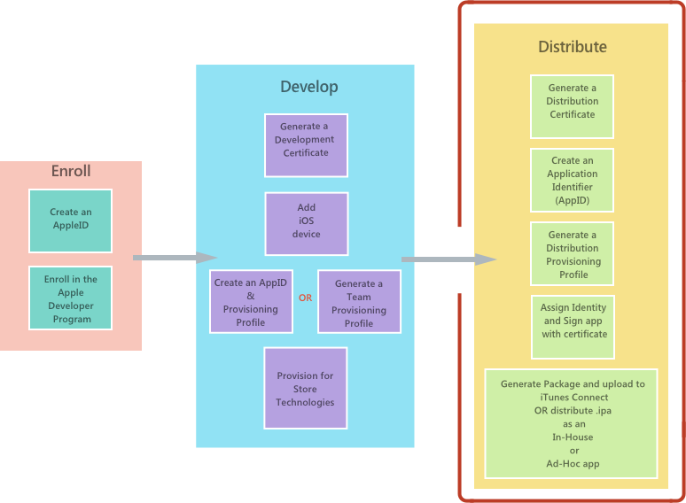

# <a href="https://docs.microsoft.com/en-us/xamarin/ios/deploy-test/app-distribution/">Xamarin.iOS app Publishing and distribution </a>
 
## 1.**Overview**
 Once an Xamarin.iOS app has been developed, 
+ the next step in the software development lifecycle is to distribute the app to users, as shown

## 2. **Distribution**
+ to distribute an iOS application,we  require that applications be provisioned using the appropriate provisioning profile. 
+ Provisioning profiles are files that contain code signing information, identity of the application ,intended distribution mechanism.
+  For the non-App Store distribution , it contain information about what devices the app can be deployed to
+ Apple provides the following ways to distribute an iOS application:
1. App Store
2. In-house (enterprise)
3. Ad hoc
4. Custom apps for business

## 3. <a href="https://docs.microsoft.com/en-us/xamarin/ios/deploy-test/app-distribution/app-store-distribution/" > App Store Distribution </a>
 + all apps and updates to the App Store must have been built with the iOS 12.1 SDK or later
 + Apps should also support the iPhone XS and 12.9" iPad Pro screen sizes.
 + this is main way that iOS applications are distributed to consumers on iOS devices. 
 + Apps are submitted to the App Store through a portal called iTunes Connect
 + developers who belong to the Apple Developer Program have access to iTunes Connect
 +   steps in App store distribution
 1. Provisioning an App for App Store Distribution
  + to release a Xamarin.iOS application, you'll need to build a Distribution Provisioning Profile specific to it
  + a Distribution Profile will contain the following:
 * An App ID
 * A Distribution Certificate
 
 1. Creating a Distribution Certificate
 2. Creating a Distribution Profile
  + Creating an App ID
  + Creating a Provisioning Profile
 3. Selecting a Distribution Profile in a Xamarin.iOS Project
 4. Configuring your Application in iTunes Connect
 <a href="https://docs.microsoft.com/en-us/xamarin/ios/deploy-test/app-distribution/app-store-distribution/itunesconnect"> Configure your App in iTunes Connect guide </a>

 5. Submitting an App to iTunes Connect

## 4. <a href="https://docs.microsoft.com/en-us/xamarin/ios/deploy-test/app-distribution/in-house-distribution">In-house distribution </a> 
 + Sometimes called Enterprise Distribution, 
 + in-house distribution allows members of the Apple Developer Enterprise Program to distribute apps internally to other members of the same organization. 
 +  advantages of not requiring an App Store review, and having no limit on the number of devices on which an application can be installed.
 +  Apple Developer Enterprise Program members do not have access to iTunes Connect,so cant distribute to store.
 + Steps: 
 1. **Creating a Distribution Certificate**
 2. **Creating a Distribution Provisioning Profile**
  + Creating an App ID
 3. <a href="https://docs.microsoft.com/en-us/xamarin/ios/deploy-test/app-distribution/ipa-support?tabs=windows">Creating an IPA for In-House Deployment</a> 
  + Once provisioned, applications can be packaged into a file known as an IPA
  + IPA  is a zip file that contains the application, along with additional metadata and icons.
 4. **Distributing your App In-House**
 + it is done using Locally through iTunes ,MDM server , An internal  secure web server, Email
 + To distribute your app in any of these ways you must first create an IPA file

## 5. <a href="https://docs.microsoft.com/en-us/xamarin/ios/deploy-test/app-distribution/ad-hoc-distribution"> Ad-hoc distribution</a>

1.   Ad Hoc distribution techniques that are primarily used for testing an Xamarin.iOS applications with a wide group of people
+  which is available on both the Apple Developer Program, and the Apple Developer Enterprise Program  and allows up to 100 iOS devices to be tested. 
+  The best use case for ad hoc distribution is distribution within a company when iTunes Connect is not an option.
+ 

2. Steps invloved:
+ 
0. Setting Up for Distribution
+  to release a Xamarin.iOS application for In-House Deployment, for testing purposes, you'll need to build an Ad Hoc Distribution Provisioning Profile specific to it.for this we will create 

1. Create a Distribution Certificate
2. Create a Distribution Provisioning Profile
3. Selecting a Distribution Profile in a Xamarin.iOS Project
4. IPA Support for Ad Hoc Deployment
+ Once provisioned, applications can be packaged into a file known as an IPA
+ The IPA is used to add an application locally into iTunes so that it can be synced directly to a device that is included in the provisioning profile.
5. Ad Hoc Distribution
+  TestFlight is a popular means of beta testing and distribution
<a href="https://docs.microsoft.com/en-us/xamarin/ios/deploy-test/testflight"> TestFlight Guide </a>

## <a href="https://developer.apple.com/business/custom-apps/"> Custom apps for business</a>
+ Apple allows custom distribution of apps to businesses and education

## Understanding provisioning Profile

### 1. Why we need?
1. Code Signing
+ this certifies or digitally signs the code written by you. 
+ it confirms that the code cannot be modified after you have signed it and in simple words,
+ we can say that it makes it more secure

### 2. Provisioning Profiles(PP)
+ Acc to Apple, A Provisioning profile is a collection of digital entities that uniquely ties developers and devices 
  to an authorized iPhone Developement Team and enables device to be used for testing.
+ Unlike Android, apple apps cannot run directly on any device. it has to be signed by Apple first.
+ Provisioning profile acts as a link between device and  developer account.
+ only devices we have provisioned ,our dev apps can only work on those devices.
+ so , PP decided that app can run on what all devices, and what services can be  accessed by the app
 * it is related to entitlement of our app, what all services it can use like push notification
1. Steps:
+ Before IPA is made, the profile are downloaded from development account or picked from the machine, 
+ and profile are embedded in bundle , 
+ and the bundle is code signed using certificates  
2. so, the extra information which authenticates you to use the app on certain devices, by using certificates and  signing the app , is PP process.

### 3. What Does a PP contains:
1. Development Certificates
+ authorizies test devices on which we want to run our apps on .
2. Unique Device Identifiers
+ List of device that the app can run on
3. Add Id
+ An Add id is a two- part string used to identify one or more apps from a single development team.
+ it is used to check if this app is authorized to run on this device.
+ it contains team id and bundle identifier,so it check bundle id of app and profile if matches then app can run 

### 4. How does an app install from XCOde
1. the developer certificate mentioned in your PP is checked against the certificates saved in your Mac's keychain.
+ this certificate is used to sign the code.
+ + device running app, its UUId is checked against PP ID
+ BUndle Identifier of the app is checked against the Id in PP
+ Entititlement requiered by your app are verified and the associated ones with your app ID
+ if all goes all, app is installed

### 5. Types of PP:
1. Development
+ contains list of test devices on which our app runs
+ cannot  be used for distribution on test side or app store
2. Ad Hoc
+ to distribute our app to beta testers
3. Enterprise 
+ 
4. Distribution 
+ doesnt contain identifier of any of our device
+ to ship it on app store
+ once apple code signs it.

### COde signing

1. give us a sense of trust, that app in not modified, and who signed it.
2. the signing identity consist of a public private key pair that apple creates for us
+ using Assymetric Crptography.
   * i.e there are pairs of , one public one private key, and two publc twp private key,
   * and one public key data can be viewed by private key of another user

+ for this we creATE A CSR

## Certificate Signing Request (CSR)
+ CSR created through our Keychain , in which public key embedded in CSR which we sent to Apple
+ A CSR is a block of encoded text that is given to a Certificate Authority when applying for a certificate
+ Apple will proff the request and issue a certificate for you.
+ THis certificate is pushed into the keychain and paired with your private key to form the COde Signing Identiity.
+ FInally, at the time of app installation, the private key used for signing the app matches the public key in th certificate given by apple 
+ if it fails ,app is not installed