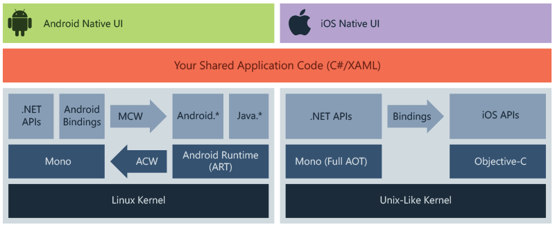
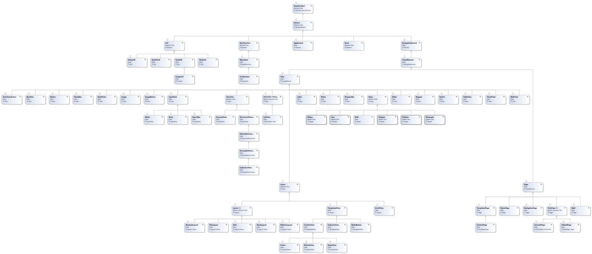
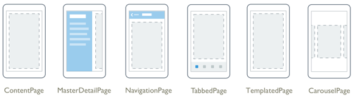
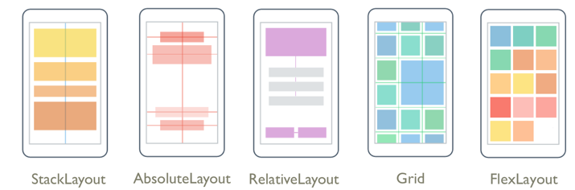
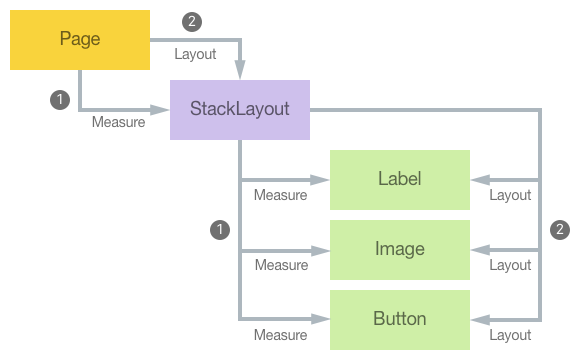

## Day1- 28/04/2021 

###  Session videos: 
\\pune-share\Training_Cyb\Reema Redkar\Mobile_Xamarin_April 2021

### 1. <a href="https://docs.microsoft.com/en-us/xamarin/get-started/installation/?pivots=windows"> Introduction to Xamarin ? </a> 


1. Xamarin is an open-source platform for building modern and performant applications for iOS, Android, and Windows with .NET. 
2. Xamarin is an abstraction layer that manages communication of shared code with underlying platform code. 
3. Xamarin runs in a managed environment that provides conveniences such as memory allocation and garbage collection.
4. Xamarin enables developers to share an average of 90% of their application across platforms. This pattern allows developers to write all of their business logic in a single language (or reuse existing application code) but achieve native performance, look, and feel on each platform.
5. Xamarin applications can be written on PC or Mac and compile into native application packages, such as an .apk file on Android, or an .ipa file on iOS.

6. uses of Xamarin : 
 * Share code, test and business logic across platforms.
 * Write cross-platform applications in C# with Visual Studio.

7. X Architecture
 

8. Xamarin allows you to create native UI on each platform and write business logic in C# that is shared across platforms

9. features : 
+ 1. Complete binding for the underlying SDKs, so compile time checking, less runtime error
+ 2.  Xamarin provides facilities for directly invoking Objective-C, Java, C, and C++ libraries, giving you the power to use a wide array of third party code,also bind libraries using declarative syntax
+ 3.  Xamarin applications are written in C#, a modern language that includes significant improvements over Objective-C and Java
+ 4. Robust Base Class Library (BCL) 
+ Xamarin applications use the .NET BCL, a large collection of classes that have comprehensive and streamlined features such as powerful XML, Database, Serialization, IO, String, and Networking support, and more. 
+ 5.  Xamarin uses Visual Studio, a modern IDE 
+ 6. Xamarin offers sophisticated mobile cross-platform support for the three major platforms . 
+ 7. Xamarin.Essentials offers a unified API to access common resources across all three platforms

### 2. Xamarin.Android 
1. Xamarin.Android applications compile from C# into Intermediate Language (IL) which is then Just-in-Time (JIT) compiled to a native assembly when the application launches.
2. Xamarin.Android applications run within the Mono execution environment, side by side with the Android Runtime (ART) virtual machine. 
3. Xamarin provides .NET bindings to the Android.* and Java.* namespaces. 
4. The Mono execution environment calls into these namespaces via **Managed Callable Wrappers** (MCW) and provides **Android Callable Wrappers** (ACW) to the ART, allowing both environments to invoke code in each other.

### 3. Xamarin.IOS 
1. Xamarin.iOS applications are fully Ahead-of-Time (AOT) compiled from C# into native ARM assembly code. 
2. Xamarin uses **Selectors** to expose Objective-C to managed C# and 
 + **Registrars** to expose managed C# code to Objective-C. 
 3. Selectors and Registrars collectively are called "bindings" and allow Objective-C and C# to communicate.

 ### 3. Xamarin.Essentials

 1. it is a library that provides cross-platform APIs for native device features. it is an abstraction that simplifies the process of accessing native functionality. 
  2. functionality  include:
+ Device info
+ File system
+ Accelerometer
+ Phone dialer
+ Text-to-speech
+ Screen lock


### 4. <a href="https://docs.microsoft.com/en-us/xamarin/get-started/what-is-xamarin-forms"> Xamarin.Forms </a>


1. Xamarin.Forms is an open-source UI framework.
2. Xamarin.Forms allows developers to build Xamarin.iOS, Xamarin.Android, and Windows applications from a single shared codebase.
3.  Xamarin.Forms allows developers to create user interfaces in XAML with code-behind in C#.
4.  These user interfaces are rendered as performant native controls on each platform. 
5. features provided by Xamarin.Forms include:

+ XAML user-interface language
+ Databinding
+ Gestures
+ Effects
+ Styling

6. Uses : 
+ Share UI layout and design across platforms.
+ Share code, test and business logic across platforms.
+ Write cross-platform apps in C# with Visual Studio.

7. **Architecture** 


+ Xamarin.Forms provides a consistent API for creating UI elements across platforms. 
+ This API can be implemented in either XAML or C# and supports databinding for patterns such as **Model-View-ViewModel** (MVVM).
+ **At runtime**, Xamarin.Forms utilizes platform renderers to convert the cross-platform UI elements into native controls on Xamarin.Android, Xamarin.iOS and UWP.
  *  This allows developers to get the native look, feel and performance while realizing the benefits of code sharing across platforms.
+ Xamarin.Forms applications typically consist of
 1.  a shared .NET Standard library 
 +   The shared library contains the XAML or C# views and any business logic such as services, models or other code.
 2. individual platform projects.
  + The platform projects contain any platform-specific logic or packages the application requires.
+ Xamarin.Forms uses the Xamarin platform to run .NET applications natively across platforms. 


8. Xamarin.Forms large ecosystem of libraries gives **additional functionality** such as 
+ 1. Xamarin.Essentials
+ 2. Shell 
   * Shell reduces the complexity of mobile application development by providing the fundamental features that most applications require, which are : 
   * Common navigation experience
   * URI-based navigation scheme   
   * Integrated search handler
+ 3. Platform-specifics
   *  Xamarin.Forms platform-specifics allow you to utilize functionality that is only available on a specific platform without creating custom renderers or effects.
    * Example :Android platform has native functionality for Fast Scrolling in a ListView but iOS does not
+ 4. Material Visual 
   *  Xamarin.Forms Material Visual is used to apply Material Design rules to Xamarin.Forms applications. 
   * Xamarin.Forms Material Visual utilizes the Visual property to selectively apply custom renderers to the UI, resulting in an application with a consistent look and feel across iOS and Android. 


### 5. <a href="https://docs.microsoft.com/en-us/xamarin/cross-platform/app-fundamentals/"> PCL vs SAP vs .Net Standard </a>


0. Need for this: 
+ A key component of building cross-platform applications is being able to share code across various platform-specific projects. However, this is complicated by the fact that 
 *   different platforms often use a different sub-set of the .NET Base Class Library (BCL), and 
 * therefore are actually built to a different .NET Core Library Profile. 
+ This means that each platform can only use class libraries that are targeted to the same profile so they would appear to require separate class library projects for each platform.


+  There are three methods for sharing code between cross-platform applications:
1. **Portable Class Libraries** (deprecated)
+  Portable Class Libraries (PCLs) can target multiple platforms with a common API surface, and use Interfaces to provide platform-specific functionality. 
+ 2. .NET Standard Libraries – .NET Standard projects can implement code to be shared across multiple platforms, and can access a large number of .NET APIs (depending on the version).  .NET Standard 2.0 provides the best coverage of the .NET BCL (including the .NET APIs available in Xamarin apps).

+ 3. Shared Projects – Use the Shared Asset Project type to organize your source code, and use #if compiler directives as required to manage platform-specific requirements.

### <a href="https://docs.microsoft.com/en-us/xamarin/get-started/first-app/?pivots=windows"> Building first Xamarin.forms app </a>


## Day2 - 29/04/2021

### 1. <a href="https://docs.microsoft.com/en-us/xamarin/xamarin-forms/xaml/xaml-basics/get-started-with-xaml?tabs=windows" > Introduction to XAML </a>


1. The eXtensible Application Markup Language (XAML) is an XML-based language created by Microsoft as an alternative to programming code for instantiating and initializing objects, and organizing those objects in parent-child hierarchies.
2.  XAML is well suited for use with the popular MVVM (Model-View-ViewModel) application architecture: XAML defines the View that is linked to ViewModel code through XAML-based data bindings.
3. the XAML information is parsed at build time to locate named objects, and again at runtime to instantiate and initialize objects, and to establish links between these objects and programming code.
4. **Advantages of XAML**
  + more readable
  + visual clarity due to parent-child hierarchy taken from XML
  + easily written, toolable and generated by visual design tools
5.  **DisAdvantages of XAML**  
  + cannot contain code, so separate code file for event handler definition 
  + cannot loop for repe processing , alt can use ListView
  + no conditional processing 
  + cannot calll methods . 
6. XAML has some unique syntax features. The most important are:
 +   Property elements
 + Attached properties
 + Markup extensions

### 2. <a href="https://docs.microsoft.com/en-us/xamarin/xamarin-forms/xaml/xaml-basics/essential-xaml-syntax"> XAML Basics </a>


+ In a Xamarin.Forms application, XAML is mostly used to define the visual contents of a page and works together with a C# code-behind file.
+ XAML is mostly designed for instantiating and initializing objects. But often, properties must be set to complex objects that cannot easily be represented as XML strings, and sometimes properties defined by one class must be set on a child class. These two needs require the essential XAML syntax features of **property elements and attached properties**.
+ 
+  Grid defines four bindable properties named RowProperty, ColumnProperty, RowSpanProperty, and ColumnSpanProperty. These are special types of bindable properties known as attached properties. They are defined by the Grid class but set on children of the Grid.
+ **Content Properties**
 * This means that the Content property-element tags are not required. Any XML content that appears between the start and end ContentPage tags is assumed to be assigned to the Content property.
+ **Platform Differences with OnPlatform** 

### 3.<a href="https://docs.microsoft.com/en-us/xamarin/xamarin-forms/xaml/xaml-basics/xaml-markup-extensions"> XAML Markup Extensions </a>


+ to set properties to objects in an indirect manner, for example, from a** resource dictionary**
+ XAML markup extensions constitute an important feature in XAML that allow properties to be set to objects or values that are referenced indirectly from other sources. XAML markup extensions are particularly important for sharing objects, and referencing constants used throughout an application, but they find their greatest utility in data bindings.
+  properties must instead reference values defined somewhere else, or which might require a little processing by code at runtime. For these purposes, XAML markup extensions are available.

<a href="https://www.xamarinhelp.com/xaml-markup-extension-cheatsheet/"> markup cheat-sheet</a>


Xamarin.Forms provides several valuable markup extensions . These fall into three categories: 
1. Markup extensions that are part of the XAML 2009 specification, These appear in XAML files with the customary x prefix and are: 
 1.  x:Static 
 2.  x:Reference 
 3.  x:Type 
 4.  x:Null 
 5.  x:Array 
These are implemented in classes that consist of the name of the markup extension with the word Ex-tension appended—for example, the StaticExtension and ReferenceExtension classes. These classes are defined in the Xamarin.Forms.Xaml assembly. 

2. The following markup extensions originated in the Windows Presentation Foundation (WPF), and with the exception of DynamicResource, are supported by Microsoft’s other implementations of XAML, including Silverlight, Windows Phone 7 and 8, and Windows 8 and 10: 
 1. StaticResource 
 2.  DynamicResource 
 3. Binding 

The DynamicResourceExtension class is public; StaticResourceExtension and BindingExtension are not, but they are available for your use in XAML files because they are accessible by the XAML parser. 
3. There is only one markup extension that is unique to Xamarin.Forms: 
 1.  ConstraintExpression class used in connection with RelativeLayout. 


### 4. <a href="https://docs.microsoft.com/en-us/xamarin/xamarin-forms/xaml/xaml-basics/data-binding-basics" >  XAML Data Bindings </a>


## Day3 -  30/04/2021

### <a href="https://docs.microsoft.com/en-us/xamarin/xamarin-forms/app-fundamentals/application-class" > Application class and app life cycle </a>


1. The Application base class offers the following features, which are exposed in your projects default **App subclass**:

   1.**A MainPage property**
   +  which is where to set the initial page for the app.
   2. A persistent **Properties dictionary**
     +  to store simple values across lifecycle state changes.
   3. A **static Current property** 
    + that contains a reference to the current application object. 
   4. It also **exposes Lifecycle methods** such as OnStart, OnSleep, and OnResume 
   5. as well as **modal navigation events**.

2. Depending on which template you chose, the App class could be defined in one of two ways:
 1. C#, 
 2. XAML & C#
  + To create an App class using XAML, the default App class must be replaced with a XAML App class and associated code-behind, 
   ```xml
   <Application xmlns="http://xamarin.com/schemas/2014/forms"
             xmlns:x="http://schemas.microsoft.com/winfx/2009/xaml"
             x:Class="Photos.App">

    </Application>

   ```
   ```C#
      public partial class App : Application
    {
      public App ()
     {
        InitializeComponent ();
        MainPage = new HomePage ();
     }
     ...
     }

   ``` 

3. MainPage property
+ The MainPage property on the Application class sets the root page of the application.
+ The MainPage property should be set in the App constructor,
```c#
public App ()
    {
        MainPage = new ContentPage { Title = "App Lifecycle Sample" }; // your page here
    }
```
4. Properties dictionary
+ The Application subclass has a static Properties dictionary which can be used to store data, in particular for use in the OnStart, OnSleep, and OnResume methods.
+  This can be accessed from anywhere in your Xamarin.Forms code using **Application.Current.Properties**.
+ The Properties dictionary uses a string key and stores an object value.
```c#
Application.Current.Properties ["id"] = someClass.ID;

if (Application.Current.Properties.ContainsKey("id"))
{
    var id = Application.Current.Properties ["id"] as int;
    // do something with id
}
```
+  he Properties dictionary can only serialize primitive types for storage. Attempting to store other types (such as List<string>) can fail silently.

5. Persistence 
+ The (**Properties dictionary**) is saved to the device automatically. Data added to the dictionary will be available when the application returns from the background or even after it is restarted.
+ an additional method on the Application class - **SavePropertiesAsync()** - which can be called to proactively persist the Properties dictionary

6. A complete Application class implementation is 
```c#
public class App : Xamarin.Forms.Application
{
    public App ()
    {
        MainPage = new ContentPage { Title = "App Lifecycle Sample" }; // your page here
    }

    protected override void OnStart()
    {
        // Handle when your app starts
        Debug.WriteLine ("OnStart");
    }

    protected override void OnSleep()
    {
        // Handle when your app sleeps
        Debug.WriteLine ("OnSleep");
    }

    protected override void OnResume()
    {
        // Handle when your app resumes
        Debug.WriteLine ("OnResume");
    }
}

```
+ This class is then instantiated in each platform-specific project and passed to the LoadApplication method which is where the MainPage is loaded and displayed to the user.

+ 1. for IOS 
  + The iOS AppDelegate class inherits from FormsApplicationDelegate. It should:
   *  Call **LoadApplication** with an instance of the App class.
   * Always return **base.FinishedLaunching (app, options);**.

```C#
[Register ("AppDelegate")]
public partial class AppDelegate :
    global::Xamarin.Forms.Platform.iOS.FormsApplicationDelegate // superclass new in 1.3
{
    public override bool FinishedLaunching (UIApplication app, NSDictionary options)
    {
        global::Xamarin.Forms.Forms.Init ();

        LoadApplication (new App ());  // method is new in 1.3

        return base.FinishedLaunching (app, options);
    }
}
```

+ 2. Android Project 
  + The Android MainActivity inherits from FormsAppCompatActivity.
  +  In the OnCreate override the LoadApplication method is called with an instance of the App class
  ```c#
  [Activity (Label = "App Lifecycle Sample", Icon = "@drawable/icon", Theme = "@style/MainTheme", MainLauncher = true,
    ConfigurationChanges = ConfigChanges.ScreenSize | ConfigChanges.Orientation)]
    public class MainActivity : FormsAppCompatActivity
    {
    protected override void OnCreate (Bundle bundle)
    {
        base.OnCreate (bundle);

        global::Xamarin.Forms.Forms.Init (this, bundle);

        LoadApplication (new App ()); // method is new in 1.3
    }
    }


  ```

+ 3. Universal Windows project (UWP) for Windows 10
   + The main page in the UWP project should inherit from WindowsPage
   ```xaml
    <forms:WindowsPage
    ...
   xmlns:forms="using:Xamarin.Forms.Platform.UWP"
   ...>
    </forms:WindowsPage>

   ``` 
    + The C# code behind construction must call LoadApplication to create an instance of your Xamarin.Forms App.

    ```c#
    public sealed partial class MainPage
     {
    public MainPage()
    {
        InitializeComponent();

        LoadApplication(new YOUR_NAMESPACE.App());
    }
      }


    ```  

### Xamarin.Forms App Lifecycle

1. The Application base class provides the following features:
 + Lifecycle methods OnStart, OnSleep, and OnResume.
 + Page navigation events PageAppearing, PageDisappearing.
 + Modal navigation events ModalPushing, ModalPushed, ModalPopping, and ModalPopped.

2. Lifecycle methods
+  Application class contains three virtual methods that can be overridden to respond to lifecycle changes:
+ 1. OnStart - called when the application starts.
+ 2. OnSleep - called each time the application goes to the background.
+ 3. OnResume - called when the application is resumed, after being sent to the background.
+  application termination will happen from the OnSleep state

```c#
protected override void OnStart()
{
    Debug.WriteLine ("OnStart");
}
protected override void OnSleep()
{
    Debug.WriteLine ("OnSleep");
}
protected override void OnResume()
{
    Debug.WriteLine ("OnResume");
}
```

3. There are two events on the Application class that provide notification of pages appearing and disappearing:
+ 1. PageAppearing - raised when a page is about to appear on the screen.
+ 2. PageDisappearing - raised when a page is about to disappear from the screen.
+ These events can be used in scenarios where you want to track pages as they appear on screen.

4. Modal navigation events
+ There are four events on the Application class, each with their own event arguments, that let you respond to modal pages being shown and dismissed:
+ 1. ModalPushing - raised when a page is modally pushed.
ModalPushed - raised after a page has been pushed modally.
ModalPopping - raised when a page is modally popped.
ModalPopped - raised after a page has been popped modally.
### Dependency Service
 https://docs.microsoft.com/en-us/xamarin/xamarin-forms/app-fundamentals/app-lifecycle

https://docs.microsoft.com/en-us/xamarin/xamarin-forms/app-fundamentals/dependency-service/

1. The **DependencyService class** is a service locator that enables Xamarin.Forms applications to invoke native platform functionality from shared code.
+ it is Static class that provides the Get<T>(DependencyFetchTarget) factory method for retrieving platform-specific implementations of the specified type T.
```c#
public static class DependencyService

METHODS
Get<T>(DependencyFetchTarget)
Returns the platform-specific implementation of type T.

Register<T,TImpl>()
Registers the platform-specific implementation of type T.

Register<T>()
Registers the platform-specific implementation of type T.

RegisterSingleton<T>(T)
Resolve<T>(DependencyFetchTarget)
The method to use to resolve dependencies by type.


```
2. Registration and Resolution
+ Platform implementations must be registered with the DependencyService, and then resolved from shared code to invoke them.

+ When using the Xamarin.Forms DependencyService to invoke native platform functionality, platform implementations must be registered with the DependencyService, and then resolved from shared code to invoke them.

* Register platform implementations
 + Platform implementations must be registered with the DependencyService so that Xamarin.Forms can locate them at runtime.
 + Registration can be performed with 
    1. the DependencyAttribute, or
    2.  with the Register and RegisterSingleton methods.
* 1. Registration by attribute
 + The DependencyAttribute can be used to register a platform implementation with the DependencyService.
 +  The attribute indicates that the specified type provides a concrete implementation of the interface.
```c#
using Xamarin.Forms;
// dependency attribute
[assembly: Dependency(typeof(DeviceOrientationService))]
namespace DependencyServiceDemos.iOS
{
    public class DeviceOrientationService : IDeviceOrientationService
    {
        public DeviceOrientation GetOrientation()
        {
            ...
        }
    }
}
```
* 2. Registration by method
+ The DependencyService.Register methods, and the RegisterSingleton method, can be used to register a platform implementation with the DependencyService.
```c#
[Register("AppDelegate")]
public partial class AppDelegate : global::Xamarin.Forms.Platform.iOS.FormsApplicationDelegate
{
    public override bool FinishedLaunching(UIApplication app, NSDictionary options)
    {
        global::Xamarin.Forms.Forms.Init();
        LoadApplication(new App());
        // register method
        DependencyService.Register<IDeviceOrientationService, DeviceOrientationService>();


        return base.FinishedLaunching(app, options);
    }
}
```
+ an overload of the Register method can be used to register a platform implementation with the DependencyService:
```c#
DependencyService.Register<DeviceOrientationService>();
```
+ an existing object instance can be registered as a singleton with the RegisterSingleton method:
```c#
var service = new DeviceOrientationService();
DependencyService.RegisterSingleton<IDeviceOrientationService>(service);
```

* 3. Resolve the platform implementations
+  Platform implementations must be resolved before being invoked. This is typically performed in shared code using 
     1. DependencyService.Get<T> method or
     2.  DependencyService.Resolve<T> method.
+ Invoking a platform implementation that hasn't been registered with the DependencyService will result in a NullReferenceException being thrown.

### Picking a Photo from the Picture Library

Dependency Service allows us to access native functionalities. Few of them are listed below.

1.	Capturing images
2.	Network connectivity checking
3.	Getting battery information
4.	Sensor information
5.	Hardware information
6.	to pick a photo from the phone's picture library.

## Day4 - 03/05/2021 <a href="https://docs.microsoft.com/en-us/xamarin/xamarin-forms/user-interface/">User Interface Controls  </a>  

reference: <a href="https://docs.microsoft.com/en-us/dotnet/api/xamarin.forms.visualelement" > VisualElement</a>


### 1. Overview
+ The user interface of a Xamarin.Forms application is constructed of objects that map to the native controls of each target platform
+ The four main control groups used to create the user interface of a Xamarin.Forms application are as follows:
  * 1. Pages
  * 2. Layouts
  * 3. Views
  * 4. Cells
+ A Xamarin.Forms
  *  page generally occupies the entire screen.
  * The page usually contains a layout, which contains views and possibly other layouts.
  *  Cells are specialized components used in connection with TableView and ListView.
+ Pages, Layouts, and Views derive from the VisualElement class
+ Inheritance : 
> Object -> BindableObject -> Element ->NavigableElement->
VisualElement
> VisualElement->Pages
> VisualElement->Layout
> VisualElement->Views




### 2. Pages
+ Xamarin.Forms Pages represent cross-platform mobile application screens.
+  A Page object represents a ViewController in iOS 
+  On Android, each page takes up the screen like an Activity, but Xamarin.Forms pages are not Activity objects. 
+ Inheritance : 
>  VisualElement-> Page-> TemplatedPage -> ContentPage



+ Xamarin.Forms supports the following page types:
 1. ContentPage
  * ContentPage is the simplest and most common type of page. 
  * A Page that displays a single view.
  * Set the Content property to a single View object, which is most often a Layout such as StackLayout, Grid, or ScrollView.

 ```c#
 [Xamarin.Forms.ContentProperty("Content")]
public class ContentPage : Xamarin.Forms.TemplatedPage
```
```
Attributes
ContentPropertyAttribute

Constructors
1. ContentPage()
Initializes a new ContentPage instance.

Fields
1. ContentProperty
Backing store for the Content property.

Properties
1. BackgroundColor
Gets or sets the color which will fill the background of a VisualElement. This is a bindable property.
(Inherited from VisualElement)

Methods
1. DisplayAlert(String, String, String)
Presents an alert dialog to the application user with a single cancel button.
(Inherited from Page)

Events 
1. Appearing
+ Indicates that the Page is about to appear.
2. Focused
+ Occurs when the element receives focus.

Explicit Interface Implementations

Extension Methods
1. AbortAnimation(IAnimatable, String)
Stops the animation.

``` 

 2. FlyoutPage
 + A FlyoutPage manages two panes of information. Set the Flyout property to a page generally showing a list or menu.
  + Set the **Detail property** to a page showing a selected item from the flyout page.
 +  The ((IsPresented property)) governs whether the flyout or detail page is visible.

3.  NavigationPage
+ The NavigationPage manages navigation among other pages using a stack-based architecture.
+  When using page navigation in your application, an instance of the home page should be passed to the constructor of a NavigationPage object.

4. Tabed page 
+ TabbedPage derives from the abstract MultiPage class and 
+ allows navigation among child pages using tabs.
+ 1. Set the Children property to a collection of pages,
+  2. or set the ItemsSource property to a collection of data objects and the ItemTemplate property to a DataTemplate describing how each object is to be visually represented.

5. CarouselPage
+ CarouselPage derives from the abstract MultiPage class and allows navigation among child pages through finger swiping. 
+ 1. Set the Children property to a collection of ContentPage objects,
+ 2.  or set the ItemsSource property to a collection of data objects and the ItemTemplate property to a DataTemplate describing how each object is to be visually represented.

6. TemplatedPage
+ TemplatedPage displays full-screen content with a control template, and is the base class for ContentPage.


### 3. Layouts
1. Xamarin.Forms Layouts are used to compose user-interface controls into visual structures.
2. The Layout and Layout<T> classes in Xamarin.Forms are specialized subtypes of views that act as containers for views and other layouts. 
3. The Layout class itself derives from View. 
4. A Layout derivative typically contains logic to set the position and size of child elements in Xamarin.Forms applications.


5. The classes that derive from Layout can be divided into two categories:
+ 1. Layouts with Single Content
+ 2. Layouts with Multiple Children

#### 6. Layouts with Single Content
+ These classes derive from Layout, which defines Padding and IsClippedToBounds properties:
1. ContentView 
+ ContentView contains a single child that is set with the Content property. 
+ The Content property can be set to any View derivative, including other Layout derivatives. 
+ ContentView is mostly used as a structural element and serves as a base class to Frame.
2. Frame 
+ The Frame class derives from ContentView and displays a border, or frame, around its child. 

3. ScrollView
+ ScrollView is capable of scrolling its contents.
+  Set the Content property to a view or layout too large to fit on the screen. (The content of a ScrollView is very often a StackLayout.) 
+ Set the Orientation property to indicate if scrolling should be vertical, horizontal, or both.

4. TemplatedView
+ TemplatedView displays content with a control template, and is the base class for ContentView.

5. ContentPresenter
+ ContentPresenter is a layout manager for templated views, used within a ControlTemplate to mark where the content that is to be presented appears.

#### 7. Layouts with Multiple Children

1. StackLayout
+ StackLayout positions child elements in a stack either horizontally or vertically based on the Orientation property. + The Spacing property governs the spacing between the children, and has a default value of 6.

2. Grid
+ Grid positions its child elements in a grid of rows and columns. 
+ A child's position is indicated using the attached properties Row, Column, RowSpan, and ColumnSpan.

3. AbsoluteLayout
+ AbsoluteLayout positions child elements at specific locations relative to its parent. 
+ A child's position is indicated using the attached properties LayoutBounds and LayoutFlags. 
+ An AbsoluteLayout is useful for animating the positions of views.

4. RelativeLayout
+ RelativeLayout positions child elements relative to the RelativeLayout itself or to their siblings.
+  A child's position is indicated using the attached properties that are set to objects of type Constraint and BoundsConstraint.

5. FlexLayout
+ FlexLayout is based on the CSS Flexible Box Layout Module, commonly known as flex layout or flex-box. 
+ FlexLayout defines six bindable properties and five attached bindable properties that allow children to be stacked or wrapped with many alignment and orientation options.


### 4. Views
1. Xamarin.Forms views are the building blocks of cross-platform mobile user interfaces.
2. Views are user-interface objects such as labels, buttons, and sliders that are commonly known as controls or widgets . 
3. The views supported by Xamarin.Forms all derive from the View class. 
4. They can be divided into several categories:
+ 1. Views for presentation
  * BoxView, ellipse, label,Line, Image,Map, OpenGLView,path,Webview
+ 2. Views that initiate commands
  * Button, ImageButton, RadioButton, RefreshView,SearchBar,Swipeview
+ 3. Views for setting values
  * CheckBox, Slider,Stepper, Switch, DatePicker,TimePicker
+ 4. Views for editing text
 + These two classes derive from the InputView class, which defines the Keyboard property:
  * Entry , Editor

+ 5. Views to indicate activity
  * ActivityIndicator, ProgressBar

+ 6. Views that display collections
*  CarouselView, CollectionView, IndicatorView, ListView, Picker, TableView

### Xamarin Views having inbuilt  scrolling feature ,Few of them are listed below: 

1.	CarouselView
2.	RefreshView
3.	CollectionView
4.	ListView
5.	Picker View


## Day 5 04/05/2021 User Interface controls continued ..


### 5.<a href = "https://docs.microsoft.com/en-us/xamarin/xamarin-forms/user-interface/controls/cells" > Cell</a>

1. Xamarin.Forms cells can be added exclusively to ListViews and TableViews.
2. A cell is a specialized element used for items in a table and describes how each item in a list should be rendered
3. Inheritence
> Object -> BindableObject-> Element-> Cell 
> Cell->TextCell->ImageCell
> Cell->SwitchCell
> Cell->EntryCell


4.  it is a template for creating a visual element.
5. Xamarin.Forms supports the following cell types : 
+ 1. TextCell
   * A TextCell displays one or two text strings. 
   * it can Set the Text property and the Detail property to these text strings.
+ 2. ImageCell
   * It is same as TextCell with a bitmap (image) set using Source property.
+ 3. SwitchCell
   *  The SwitchCell contains text set with the Text property *  an on/off switch initially set with the Boolean On property, it  Handle the OnChanged event from On property changes. 

+ 4. EntryCell
  *  The EntryCell defines a Label property that identifies the cell and a single line of editable text in the Text property.
  *  Handle the **Completed event** to be notified when the user has completed the text entry. 

```c#
namespace FormsGallery
{
    class SwitchCellDemoPage : ContentPage
    {
        public SwitchCellDemoPage()
        {
            Label header = new Label
            {
                Text = "SwitchCell",
                FontSize = Device.GetNamedSize (NamedSize.Large, typeof(Label)),
                HorizontalOptions = LayoutOptions.Center
            };

            TableView tableView = new TableView
            {
                Intent = TableIntent.Form,
                Root = new TableRoot
                {
                    new TableSection
                    {
                        new SwitchCell
                        {
                            Text = "SwitchCell:"
                        },
                        new EntryCell {
                            Label = "EntryCell:",
                            Placeholder = "default keyboard",
                            Keyboard = Keyboard.Default
                        }, 
                        new SwitchCell {
                            Text = "SwitchCell:"
                        }, 
                        ,
                         new ImageCell
                        {
                            // Some differences with loading images in initial release.
                       ImageSource = Device.OnPlatform(ImageSource.FromUri(new Uri("http://xamarin.com/images/index/ide-xamarin-studio.png")),
                       ImageSource.FromFile("ide_xamarin_studio.png"),
                       ImageSource.FromFile("Images/ide-xamarin-studio.png")),
                      Text = "This is an ImageCell",
                      Detail = "This is some detail text",
                        }
                    }
                }
            };
            // Build the page.
            this.Content = new StackLayout
            {
                Children =
                {
                    header,
                    tableView
                }
            };
        }
    }
}

```


###  Common properties, methods and events in VisualElement class
1. The Xamarin.Forms VisualElement class is the base class for most of the controls used in a Xamarin.Forms application. 
2. The VisualElement class defines many properties, methods, and events that are used in deriving classes.
3. Properties 
+  Background, BackgroundColor, Behaviors,Bounds, Clip, Effects, FlowDirection,Parent,Resources, Style,StyleClass,Triggers, Visual,
+ **(double) :** 
  + AnchorX, AnchorY, Height, HeightRequest, MinimumHeightRequest,MinimumWidthRequest,Opacity,Rotation/X/Y,
Scale/X/Y, TabIndex,  TranslationX/Y, Width,WidthRequest,X,Y
+ **(bool):**
  +  InputTransparent(f), IsEnabled(t),IsFocused(),IsTabStop(),IsVisible(), 

4. Methods 
+ FindByName(string name), Focus (), Unfocus ()

5. Events
+ Focused,SizeChanged,Unfocused,

6. Units of Measurement 
+  Xamarin.Forms uses a platform-independent unit of measurement that normalizes units across devices and platforms. + There are 160 units per inch, or 64 units per centimeter, in Xamarin.Forms.

7. Minimum request properties include MinimumHeightRequest and MinimumWidthRequest, and are intended to enable more precise control over how elements handle overflow relative to each others.
8. The behavior is undefined when the minimum value is greater than the absolute value.
9. Grid layouts have their own system for relative sizing of rows and columns,so no effect using Minimum-H/W-Request 

### Third-party controls
n addition to the controls supplied with Xamarin.Forms, third-party controls are available from the following companies:

<a href="https://www.telerik.com/xamarin-ui"> Telerik </a>
<a href="https://www.syncfusion.com/xamarin-ui-controls"> SyncFusion</a>
<a href="https://www.devexpress.com/xamarin/"> DevExpress </a>
<a href="https://www.infragistics.com/products/xamarin"> Infragistics </a>
<a href="https://www.grapecity.com/componentone-xamarin/">ComponentOne </a>
<a href="https://www.steema.com/product/forms"> Steema</a>


## Demo on UserInterface controls 

### I. Present data

#### 1. BoxView 
+  BoxView renders a simple rectangle of a specified width, height, and color. 
+ it use BoxView for rendering graphics, decoration, rudimentary graphics, and for interaction with the user through touch.
+ it comepensate for no built-in vector graphics system
+ following properties of BoxView:
1. Color to set its color.
2. CornerRadius to set its corner radius.(top left, top right, bottom left, and bottom right)
3. WidthRequest to set the width of the BoxView in device-independent units.(in unconstrained layout)
4. HeightRequest to set the height of the BoxView.
```c#
// a one-inch-square unconstrained BoxView
    <BoxView Color="CornflowerBlue"
             CornerRadius="10"
             WidthRequest="160"
             HeightRequest="160"
             VerticalOptions="Center"
             HorizontalOptions="Center" />
```
#### 2. Images
+ Xamarin.Forms uses the Image view to display images on a page. It has several important properties:
1. Source - An **ImageSource** instance, either File, Uri or Resource, which sets the image to display.
+ using static methods FromUri, FromFile, FromResource,FromStream
2. Aspect - How to size the image within the bounds it is being displayed within (whether to stretch, crop or letterbox)
+ It determines how the image will be scaled to fit the display area with options like Fill,AspectFill,AspectFit,

```c#
<Image Source="waterfront.jpg" />
//or
var image = new Image { Source = "waterfront.jpg" };
// device specific
image.Source = Device.RuntimePlatform == Device.Android
? ImageSource.FromFile("waterfront.jpg")
 : ImageSource.FromFile("Images/waterfront.jpg");

```
+ Additional control that display images are :Button, ImageButton, ToolbarItem, ImageCell,Page
+ support for displaying small, animated GIFs. This is accomplished by setting the Image.Source property to an animated GIF file, By default, when an animated GIF is loaded it will not be played. This is because the IsAnimationPlaying property is set to false , need to be true 

+ Only iOS and UWP applications require a splash screen (also called a startup screen or default image).

#### 3. Label 
+ The Label view is used for displaying text, both single and multi-line.
+  Labels can have text decorations, colored text, and use custom fonts (families, sizes, and options).
1. Text decorations
+ using Label.TextDecorations propertyseting one or multiple values from None,Underline ,Strikethrough
> <Label Text="This is underlined text." TextDecorations="Underline"  />
> var underlineLabel = new Label { Text = "This is underlined text.", TextDecorations = TextDecorations.Underline };
2.  Transform Text
+ using TextTransform property to a value of the TextTransform enumeration, like None,Default,Lowercase,Uppercase
> <Label Text="text uppercase." TextTransform="Uppercase" />
```c#
Label label = new Label
{
    Text = "This text will be displayed in uppercase.",
    TextTransform = TextTransform.Uppercase
};
```
3. Character spacing
+ using Label.CharacterSpacing property to a double value

4. New Lines
 + two main techniques for forcing text in a Label onto a new line, from XAML
+ Use the unicode line feed character, "&#10;"
> <Label Text="First line &#10; Second line" />
+ Specify your text using property element syntax.
```xml
   <Label>
    <Label.Text>
        First line
        Second line
    </Label.Text>
   </Label>
```

5. Colors 
+ text color via the bindable TextColor property.

6. Truncation and wrapping
+ by the LineBreakMode property. it is an enumeration with the following values:
+ CharacterWrap,NoWrap, WordWrap

7. Display a specific number of lines
+  lines displayed by a Label can be specified by setting the Label.MaxLines property to a int value

8. Display HTML
+ TextType property, determines whether the Label instance should display plain text, or HTML text.set using
Text or Html 

9. Formatted text
+  a FormattedText property that allows the presentation of text with multiple fonts and colors in the same view

10. Line height
+ The vertical height of a Label and a Span can be customized by setting the Label.LineHeight property or Span.LineHeight to a double value.

11. Padding
+ Padding can be applied to Label instances by setting the Label.Padding property to a Thickness value

12. Hyperlinks
+ text displayed by Label and Span instances can be turned into hyperlinks

```XML
<Label>
    <Label.FormattedText>
        <FormattedString>
      <Span Text="Alternatively, click " />
      <Span Text="here"
            TextColor="Blue"
            TextDecorations="Underline">
          <Span.GestureRecognizers>
             <TapGestureRecognizer Command="{Binding TapCommand}"
             CommandParameter="https://docs.microsoft.com/xamarin/" />
                </Span.GestureRecognizers>
            </Span>
            <Span Text=" to view Xamarin documentation." />
        </FormattedString>
    </Label.FormattedText>
</Label>
```
 
#### 4.  <a href="https://docs.microsoft.com/en-us/xamarin/xamarin-forms/user-interface/map/">Map </a>


#### 5.  <a href="https://docs.microsoft.com/en-us/xamarin/xamarin-forms/user-interface/shapes/
"> Shapes</a>
+ A Shape is a type of View that enables you to draw a shape to the screen. 


1. Ellipse
```XML
<Ellipse Fill="Red"
         WidthRequest="150"
         HeightRequest="50"
         HorizontalOptions="Start" />
```
2. Xamarin.Forms Shapes classes have FillRule properties, of type FillRule. These include Polygon, Polyline, and GeometryGroup.
+ FillRule enumeration defines EvenOdd and Nonzero members. 
+ Each member represents a different rule for determining whether a point is in the fill region of a shape.

3. Geometry class, and the classes that derive from it, enable you to describe the geometry of a 2D shape
+ it is the parent class for several classes that define different categories of geometries:
* 1. EllipseGeometry : ellipse or circle.
```XML
<Path Fill="Blue"
      Stroke="Red">
  <Path.Data>
    <EllipseGeometry Center="50,50"
                     RadiusX="50"
                     RadiusY="50" />
  </Path.Data>
</Path>
```
* 2. GeometryGroup:   container that can combine multiple geometry objects into a single object.
```XML
<!--using polygon class -->
<Polygon Points="40,10 70,80 10,50"
         Fill="AliceBlue"
         Stroke="Green"
         StrokeThickness="5" />

```
* 3. LineGeometry, represents  line.
```XML
<Path Stroke="Black">
  <Path.Data>
    <LineGeometry StartPoint="10,20"
                  EndPoint="100,130" />
                  
  </Path.Data>
</Path>

<!-- Or use line class --> 
<Line X1="40"
      Y1="0"
      X2="0"
      Y2="120"
      Stroke="Red" />

       <!-- create polyline-->
      <Polyline Points="0,0 10,30, 15,0 18,60 23,30 35,30 40,0 43,60 48,30 100,30"
          Stroke="Red" />
```
* 4. PathGeometry, geometry of a complex shape that can be composed of arcs, curves, ellipses, lines, and rectangles.
```XML
<!-- how to draw a triangle using path markup syntax-->
<Path Data="M 10,100 L 100,100 100,50Z"
      Stroke="Black"
      Aspect="Uniform"
      HorizontalOptions="Start" />
     
```

* 5. RectangleGeometry:  rectangle or square.
```XML
<Path Fill="Blue"
      Stroke="Red">
  <Path.Data>
    <RectangleGeometry Rect="10,10,150,100" />
  </Path.Data>
</Path>

<!--using rectangle class-->
<Rectangle Fill="Red"
           WidthRequest="150"
           HeightRequest="50"
           HorizontalOptions="Start" />
```
+ both seem similar but, Geometry class derives from the BindableObject class, while the Shape class derives from the View class.

#### 6. Web View
1. WebView is a view for displaying web and HTML content in your app
2. supports the following types of content:
+ HTML & CSS websites,Documents ,HTML strings,Local Files

```c#
// To display a website  from internet
var browser = new WebView
{
  Source = "https://dotnet.microsoft.com/apps/xamarin"
};

```

3. HTML string
+ to present a string of HTML defined dynamically in code,need to create an instance of HtmlWebViewSource:
```C#
var browser = new WebView();
var htmlSource = new HtmlWebViewSource();
htmlSource.Html = @"<html><body>
  <h1>Xamarin.Forms</h1>
  <p>Welcome to WebView.</p>
  </body></html>";
browser.Source = htmlSource;
```
4. Local HTML 
+ WebView can display content from HTML, CSS and JavaScript embedded within the app, in html,css files
+ To display local content using a WebView, open the HTML file, then load the contents as a string into the Html property of an HtmlWebViewSource

+ On iOS, the web content should be located in the project's root directory or Resources directory with build action BundleResource
+ On Android, place HTML, CSS, and images in the Assets folder with build action AndroidAsset 

5. WebView supports navigation through 
+ GoForward() ,GoBack() , to check bool --> CanGoBack ,CanGoForward

### II. Intiate commands

#### 1. Button
```xml
<Button Text="Click to Rotate Text!"
                VerticalOptions="CenterAndExpand"
                HorizontalOptions="Center"
                Clicked="OnButtonClicked" />
```
#### 2. ImageButton
```xml
<ImageButton Source="XamarinLogo.png"
                    HorizontalOptions="Center"
                    VerticalOptions="CenterAndExpand" />
```
#### 3. RadioButton
```Xml
<StackLayout>
    <Label Text="What's your favorite animal?" />
    <RadioButton Content="Cat" />
    <RadioButton Content="Dog" />
    <RadioButton Content="Elephant" />
    <RadioButton Content="Monkey"
                 IsChecked="true" />
</StackLayout>

```
#### 4. RefreshView
+ it is a container control that provides pull to refresh functionality for scrollable content. Therefore, the child of a RefreshView must be a scrollable control, such as ScrollView, CollectionView, or ListView.
```xml 
<RefreshView IsRefreshing="{Binding IsRefreshing}"
             Command="{Binding RefreshCommand}">
    <ScrollView>
        <FlexLayout Direction="Row"
                    Wrap="Wrap"
                    AlignItems="Center"
                    AlignContent="Center"
                    BindableLayout.ItemsSource="{Binding Items}"
                    BindableLayout.ItemTemplate="{StaticResource ColorItemTemplate}" />
    </ScrollView>
</RefreshView>``xml

```

#### 5. Searchbar
+ The Xamarin.Forms SearchBar is a user input control used to initiating a search.
+  The SearchBar control supports placeholder text, query input, search execution, and cancellation. 
```XML 
<SearchBar Placeholder="Search items..."
           CancelButtonColor="Orange"
           PlaceholderColor="Orange"
           TextColor="Orange"
           TextTransform="Lowercase"
           HorizontalTextAlignment="Center"
           FontSize="Medium"
           FontAttributes="Italic" />
```
#### 6. SwipeView
+ The SwipeView is a container control that wraps around an item of content, and provides context menu items that are revealed by a swipe gesture
```xml
<SwipeView>
    <SwipeView.LeftItems>
        <SwipeItems>
            <SwipeItem Text="Favorite"
                       IconImageSource="favorite.png"
                       BackgroundColor="LightGreen"
                       Invoked="OnFavoriteSwipeItemInvoked" />
            <SwipeItem Text="Delete"
                       IconImageSource="delete.png"
                       BackgroundColor="LightPink"
                       Invoked="OnDeleteSwipeItemInvoked" />
        </SwipeItems>
    </SwipeView.LeftItems>
    <!-- Content -->
    <Grid HeightRequest="60"
          WidthRequest="300"
          BackgroundColor="LightGray">
        <Label Text="Swipe right"
               HorizontalOptions="Center"
               VerticalOptions="Center" />
    </Grid>
</SwipeView>
```

### III.  Set values
#### 1. CheckBox
+ CheckBox is a type of button that can either be checked or empty. 
```xml
<CheckBox IsChecked="false"  CheckedChanged="OnCheckBoxCheckedChanged" />

```
#### 2. DataPicker
+ It is A Xamarin.Forms view that allows the user to select a date.

```xml
<DatePicker MinimumDate="01/01/2018"
            MaximumDate="12/31/2018"
            Date="06/21/2018" />
```
#### 3. Slider
+ Use a Slider for selecting from a range of continuous values.
```xml
<ContentPage xmlns="http://xamarin.com/schemas/2014/forms"
             xmlns:x="http://schemas.microsoft.com/winfx/2009/xaml"
             x:Class="SliderDemos.BasicSliderXamlPage"
             Title="Basic Slider XAML"
             Padding="10, 0">
    <StackLayout>
        <Label x:Name="rotatingLabel"
               Text="ROTATING TEXT"
               FontSize="Large"
               HorizontalOptions="Center"
               VerticalOptions="CenterAndExpand" />

        <Slider Maximum="360"
                ValueChanged="OnSliderValueChanged" />

        <Label x:Name="displayLabel"
               Text="(uninitialized)"
               HorizontalOptions="Center"
               VerticalOptions="CenterAndExpand" />
    </StackLayout>
</ContentPage>
```
+ code-behind file contains the handler for the ValueChanged event:
```c#
public partial class BasicSliderXamlPage : ContentPage
{
    public BasicSliderXamlPage()
    {
        InitializeComponent();
    }

    void OnSliderValueChanged(object sender, ValueChangedEventArgs args)
    {
        double value = args.NewValue;
        rotatingLabel.Rotation = value;
        displayLabel.Text = String.Format("The Slider value is {0}", value);
    }
}

```
#### 4. Stepper
+ Use a Stepper for selecting a numeric value from a range of values.consists of two buttons labeled with minus and plus signs
```xml

```
#### 5. Switch 
+ The Xamarin.Forms Switch control is a horizontal toggle button that can be manipulated
```xml
<Switch IsToggled="true" OnColor="Orange"
        ThumbColor="Green" />
```
#### 6. TimePicker
+ It  invokes the platform's time-picker control and allows the user to select a time
```xml
<TimePicker Time="4:15:26" />
```

### IV. Edit Text
#### 1. Editor
+ The Editor, like other text-presenting views, exposes the Text property. 
+ This property can be used to set and read the text presented by the Editor
```xml
<Editor Text="I am an Editor" />

<Editor Placeholder="Enter text here" PlaceholderColor="Olive" />
<!--Prevent text entry-->
<Editor Text="This is a read-only Editor"
        IsReadOnly="true" />
```
#### 2. Entry
+ The Xamarin.Forms Entry is used for single-line text input. The Entry, like the Editor view, supports multiple keyboard types.
+  Additionally, the Entry can be used as a password field.
```xml
<Entry Placeholder="Username" PlaceholderColor="Olive" />
```

### V. Indicate activity
#### 1.  ActivityIndicator
+  ActivityIndicator control displays an animation to show that the application is engaged in a lengthy activity
+ no indication of progess

```xml
<ActivityIndicator IsRunning="true" Color="Orange" />
```
#### 2. ProgressBar
+  ProgressBar control visually represents progress as a horizontal bar that is filled to a percentage represented by a float value. 
```xml
<ProgressBar Progress="0.5" ProgressColor="Orange" />
```

###  VI. Display collections

#### 1. CarouselView
+ CarouselView is a view for presenting data in a scrollable layout, where users can swipe to move through a collection of items. 
+ CarouselView will display its items in a horizontal orientation.provides looped access to its collection of items.
+ CarouselView is typically used to highlight information in a list of limited length.
 following properties that define the data to be displayed, and its appearance:
1. ItemsSource, of type IEnumerable, specifies the collection of items to be displayed, and has a default value of null.
2. ItemTemplate, of type DataTemplate, specifies the template to apply to each item in the collection of items to be displayed.
```xml
<CarouselView ItemsSource="{Binding Monkeys}" />
```

```c#
CarouselView carouselView = new CarouselView();
carouselView.SetBinding(ItemsView.ItemsSourceProperty, "Monkeys");
```

#### 2. CollectionView
+  CollectionView is typically used to present lists of data of any length
+he CollectionView is a flexible and performant view for presenting lists of data using different layout specifications.
+ A CollectionView is populated with data by setting its ItemsSource property to any collection that implements IEnumerable. The appearance of each item in the list can be defined by setting the ItemTemplate property to a DataTemplate.
+ By default, a CollectionView will display its items in a vertical list. However, vertical and horizontal lists and grids can be specified.


#### 3. IndicatorView
+ The IndicatorView is a control that displays indicators that represent the number of items, and current position, in a CarouselView:
```XML
<StackLayout>
    <CarouselView ItemsSource="{Binding Monkeys}"
                  IndicatorView="indicatorView">
        <CarouselView.ItemTemplate>
            <!-- DataTemplate that defines item appearance -->
        </CarouselView.ItemTemplate>
    </CarouselView>
    <IndicatorView x:Name="indicatorView"
                   IndicatorColor="LightGray"
                   SelectedIndicatorColor="DarkGray"
                   HorizontalOptions="Center" />
</StackLayout>
```

#### 4. ListView
+ ListView is a view for presenting lists of data, especially long lists that require scrolling. 


#### 5. Picker
+ The Picker view is a control for selecting a text item from a list of data.
+ it displays a short list of items, from which the user can select an item. 


#### 6. TableView
+   TableView is a view for displaying scrollable lists of data or choices where there are rows that don't share the same template. 
+ Unlike ListView, TableView does not have the concept of an ItemsSource, so items must be manually added as children.
+  useful when:
  * presenting a list of settings,
  * collecting data in a form, or
  * showing data that is presented differently from row to row
### VII.  Additional controls
#### 1. MenuItem
+  MenuItem class defines menu items for menus such as ListView item context menus and Shell application flyout menus.

#### 2. TOolbaritem 
 + ToolbarItem class is a special type of button that can be added to a Page object's ToolbarItems collection. 
```xml
<ContentPage.ToolbarItems>
    <ToolbarItem Text="Example Item"
                 IconImageSource="example_icon.png"
                 Order="Primary"
                 Priority="0" />
</ContentPage.ToolbarItems>
```


### List all Xamarin controls with pre-defined bindable property?  
List of Xamarin.Forms Controls with pre-defined bindable properties :
1. in Label Label.Text
2.  in Button  Button.BorderRadius
3. in StackLayout  StackLayout.Orientation. 
4. AbsoluteLayout LayoutBounds , LayoutFlags
5. in Image IsAnimationPlaying 
6. Shape Class properties
7. in Checkbox IsChecked property
8. DataPicker all properties
9. Slider all properties.
10. Stepper all properties.
11. Switch all properties
12. TimePicker all properties
13. Entry TextColor,BackgroundColor properties
14. ActivityIndicator Color,IsRunning properties
15. ProgressBar Progess,ProgressColor properties
16. IndicatorView properties.
17. Picker properties. 
18. SwitchCell Text,On,OnColor properties. 
19. MenuItem properties.
19. ToolbarItem properties. 

## Day 6 5/5/2021 

### <a href="https://docs.microsoft.com/en-us/xamarin/xamarin-forms/xaml/resource-dictionaries" > Resource Dictionary (RD)</a>


1. A ResourceDictionary is a repository for resources (styles, control templates, data templates, colors, and converters ) that are used by a Xamarin.Forms application. 
 2. It is a IDictionary that maps identifier strings to arbitrary resource objects.
3. Inheritance Object --> ResourceDictionary

4. Properties: 
 +  Count : The number of entries in it.
 + Item[String] : Retrieves the Object value associated with the key index.
 + Keys : The collection of  keys in the it.
 + MergedDictionaries : Gets the collection of dictionaries  merged into this dictionary.
+ Source : Gets or sets the URI of the merged RD.
+ Values : Retrieves the values of RD.

5. Methods
+ Add(ResourceDictionary), Add(String, Object), Add(Style),Add(StyleSheet),Clear(),ContainsKey(String),GetEnumerator(),
Remove(String)

6. Use: 
+ In XAML, resources in ResourceDictionary can be referenced and applied to elements by using the StaticResource or DynamicResource ME. 
+  In C#, resources can also be defined in a ResourceDictionary and then referenced and applied to elements by using a string-based indexer

7. Every VisualElement derived object and Application derived object has a Resources property, which is a RD
+ where we create resource impacts it scope, it can be at  View (Button),Layout,page,App level. 

8.  exception of implicit styles, each resource in RD must have a unique string key i.e x:Key attribute.

9. Consuming Resources from RD ,loopup Process
 * the StaticResource markup extension performs a single dictionary lookup, 
  * the DynamicResource markup extension maintains a link to the dictionary key. so if the dictionary entry associated with the key is replaced, the change is applied to the visual element.it enables runtime resource changes to be made in an application
  *  lookup process takes place from RD, then searches visual tree upwards till application level, if not found throws XamlParseException
  * resource defined lower in visual tree takes precedence over higher, like application level overriden by page level, it by layout level, it by view level
10. A class derived from RD can also be in a stand-alone XAML file. The XAML file can then be shared among applications.  

11. Merged resource dictionaries combine one or more RD objects into another RD
+ A local RD file can be merged into another RD by creating a RD object whose Source property is set to the filename of the XAML file with the resources,  it references the XAML file.
>  <ResourceDictionary Source="MyResourceDictionary.xaml" />

+ A ResourceDictionary can also be merged into another ResourceDictionary by adding it into the MergedDictionaries property of the ResourceDictionary


```XML
<!-- create RD-->
<Application>
<Application.Resources>

        <Thickness x:Key="PageMargin">20</Thickness>
   <Color x:Key="NavigationBarTextColor">White</Color>
        <!-- Implicit styles -->
        <Style TargetType="{x:Type NavigationPage}">
            <Setter Property="BarTextColor"
                    Value="{StaticResource NavigationBarTextColor}" />
        </Style>
  </Application.Resources>
  </Application>
```

```XML
<!-- consume RD-->
<StackLayout Margin="{StaticResource PageMargin}">
        <StackLayout.Resources>
            <!-- Implicit style -->
            <Style TargetType="Button">
                <Setter Property="FontSize" Value="Medium" />
            </Style>
        </StackLayout.Resources>
        <Label Text="This app demonstrates consuming resources that have been defined in resource dictionaries." />
        <Button Text="Navigate"
                Clicked="OnNavigateButtonClicked" />
    </StackLayout>

```

 
##  <a href=" https://docs.microsoft.com/en-us/xamarin/xamarin-forms/user-interface/styles/
">Styles </a>

### 1. **Introduction** 
+ Setting the appearance of each individual control can be repetitive and error prone. 
+ Styles allow the appearance of visual elements to be customized,it is defined for specific types, with property values avalaible for that type.
+ a style can be created that defines the appearance, and then applied to the required controls.
+   Stying in Xamarin.Forms App can be done in two ways: 
+ 1.  **one : usign XAML Styles**
 
+ 2. **two : using Cascading Style Sheets (CSS)**
  * Xamarin.Forms supports styling visual elements using CSS. 
  * A style sheet consists of a list of rules, with each rule consisting of one or more selectors, and a declaration block.

### 2.styling visual element using XAML Styles class
+  it uses the Style class to group a collection of property values into one object that can then be applied to multiple visual element instances.
+ it helps to reduce repetitive markup, and allows an apps appearance to be more easily changed.
+ Styles primary XAML-based ,also be created in C#:
+ 1. using XAML 
   * in XAML Style instance are defined in a ResourceDictionary that's assigned to the Resources collection of a control, page, or to the Resources collection of the application.
+ 2. using C#
    *  Style instances created in C# are defined in the page's class, or a class that can be globally accessed.

+ based on level which Style are defined, it scope is set, like app ,page,layout,control level

#### 3.  **Style  Class**  
 * 
 1.  Style  class Instance Contains  one or more Setter objects with each Setter having a Property and a Value.
 2.  The Property is the name of the bindable property of the element the style is applied to, and
 3.   the Value is the value that is applied to the property. 
  4.  Inheritance : Object --> Style
  5. Properties: 
  + ApplyToDerivedTypes(bool): control if style applied to controls derviced from base type
  + BasedOn 
  +  BaseResourceKey
  +  Behaviors :Get list of Behavior objects belong to this Style.
  +  CanCascade(bool) 
  +  Class:Gets or sets the class for the style.
  +  Setters: Gets the list of Setter objects that belong to this Style.
  + TargetType: Gets the type of object that this style can describe
  +  Triggers:Gets the list of Trigger objects that belong to this Style.


 #### 4.  Style instance can be 
 1. **explicit Style** 
   * instance  defined by specifying a TargetType and an x:Key value
   * here, we set the target element's Style property to the x:Key reference, targetType must be a VisualElement like label .
  + we can use C# code to do the same below code, using style object declared in constructor, and assign them to RD usig add method , or directly assignb to control Style property 
```xml

<Contentpage ...>
<ContentPage.Resources>
        <ResourceDictionary>
        <!-- style at page level-->
<Style x:Key="labelStyle" TargetType="Label">
    <Setter Property="HorizontalOptions" Value="Center" />
    <Setter Property="VerticalOptions" Value="CenterAndExpand" />
    <Setter Property="FontSize" Value="Large" />
</Style>
</ResourceDictionary>
    </ContentPage.Resources>
    <ContentPage.Content>
<!-- Applying style at control level -->
<StackLayout.Resources>
                <ResourceDictionary>
                    <Style x:Key="labelRedStyle" TargetType="Label">
                      ...
                    </Style>
                    ...
                </ResourceDictionary>
                 </StackLayout.Resources>
<Label Text="Demonstrating an explicit style" Style="{StaticResource labelStyle}" />

<Label Text="These labels" Style="{StaticResource labelRedStyle}" />
 </StackLayout>
 </ContentPage.Content>
</ContentPage>
```
 2. **An implicit Style** 
   * instance is defined by specifying only a TargetType.
   *  An implicit style is one that's used by all controls of the same TargetType, without requiring each control to reference the style.
   * The **Style.ApplyToDerivedTypes** property enables a style to be applied to controls that are derived from the base type referenced by the TargetType property. 
  ```xml
   <ContentPage ...>
    <ContentPage.Resources>
        <ResourceDictionary>
        <!--Page level impilict style-->
            <Style TargetType="Entry" ApplyToDerivedTypes="False">
             <Setter Property="BackgroundColor" Value="Yellow" />        
            </Style>
        </ResourceDictionary>
    </ContentPage.Resources>
    <ContentPage.Content>
        <StackLayout Padding="0,20,0,0">
          <!--control level impilict style,applied to the control and its children.-->
           <StackLayout.Resources>
                <ResourceDictionary>
                    <Style TargetType="Entry">
                        <Setter Property="HorizontalOptions" Value="Fill" />
                        ...
                    </Style>
                </ResourceDictionary>
            </StackLayout.Resources>

            <Entry Text="These entries" />
            <Entry Text="and an implicit style override" BackgroundColor="Lime" TextColor="Red" />
            <local:CustomEntry Text="Subclassed Entry is not receiving the style" />
        </StackLayout>
    </ContentPage.Content>
</ContentPage>
  ``` 

3. **Global Styles**
+ Styles can be made available globally by adding them to the application's resource dictionary.
+  This helps to avoid duplication of styles across pages or controls
+  app level style overrided by page level style, page by control . 

```xml
<!--style declared at app level : global styles-->
<Application ...>
    <Application.Resources>
        <ResourceDictionary>
            <Style x:Key="buttonStyle" TargetType="Button">
              <Setter Property="BorderColor" Value="Lime" />
            </Style>
        </ResourceDictionary>
    </Application.Resources>
</Application>
```
```xml
<!--applying the above buttonStyle to the page's Button instances-->
<ContentPage ...>
    <ContentPage.Content>
        <StackLayout Padding="0,20,0,0">
            <Button Text="application style overrides" Style="{StaticResource buttonStyle}" />
        </StackLayout>
    </ContentPage.Content>
</ContentPage>
```

4. Dynamic Styles
+ Styles do not respond to property changes, and remain unchanged for the duration of an application.
+ but applications can respond to style changes dynamically at runtime by using dynamic resources.
+  DynamicResource markup extension use a dictionary key to fetch a value from a ResourceDictionary.
+ it maintains a link to the dictionary key. Therefore, if the dictionary entry associated with the key is replaced, the change is applied to the visual element
+ This enables runtime style changes to be made in an application.


```xml
<ContentPage.Content>
        <StackLayout Padding="0,20,0,0">
            <SearchBar Placeholder="These SearchBar controls"
                       Style="{DynamicResource searchBarStyle}" />
            ...
        </StackLayout>
    </ContentPage.Content>
```
```c#
public partial class DynamicStylesPage : ContentPage
{
    bool originalStyle = true;

    public DynamicStylesPage ()
    {
        InitializeComponent ();
        Resources ["searchBarStyle"] = Resources ["blueSearchBarStyle"];
    }

    void OnButtonClicked (object sender, EventArgs e)
    {
        if (originalStyle) {
            Resources ["searchBarStyle"] = Resources ["greenSearchBarStyle"];
            originalStyle = false;
        } else {
            Resources ["searchBarStyle"] = Resources ["blueSearchBarStyle"];
            originalStyle = true;
        }
    }
}     
```
* Dynamic style inheritance
+ Deriving a style from a dynamic style can't be achieved using the Style.BasedOn property.
+ the Style class includes the **BaseResourceKey property**, which can be set to a dictionary key whose value might dynamically change
```xml
<!--dictonary key searchBarStyle in C# back file-->
<Style x:Key="tealSearchBarStyle" TargetType="SearchBar" BaseResourceKey="searchBarStyle">
 </Style> 

  <SearchBar Text="These SearchBar controls" Style="{StaticResource tealSearchBarStyle}" />
```            
5. Device Styles
* in  Xamarin.Forms  Device.Styles class we have six dynamic styles, known as device styles, they are : 
+ BodyStyle
+ CaptionStyle
+ ListItemDetailTextStyle
+ ListItemTextStyle
+ SubtitleStyle
+ TitleStyle
* All six styles can only be applied to Label instances.

```xml
<Label Text="Title style"
  Style="{DynamicResource TitleStyle}" />
```
#### 5. Style Inheritence 
1. Styles can inherit from other styles to reduce duplication and enable reuse.
2. it done  by setting the Style.BasedOn property to an existing Style, In
+ . In XAML, done by setting the BasedOn property to a StaticResource markup extension that references a previously created Style. 
+ In C#, this is achieved by setting the BasedOn property to a Style instance.
3. styles inherit from base style must target same type, or derived targettype of  base style.
+ ex: if base style targets View ,so style based on base style can target View or it derive like Label,Button
4. An implicit style can be derived from an explicit style, but an explicit style can't be derived from an implicit style.
5. A style can only inherit from styles at the same level, or above, in the view hierarchy
+ example: a control level resource can inherit, app,page level resource ,
```xml
<!---->
<ContentPage ...>
    <ContentPage.Resources>
        <ResourceDictionary>
            <Style x:Key="baseStyle" TargetType="View">
                <Setter Property="HorizontalOptions"
                        Value="Center" />
            </Style>
            <Style x:Key="labelStyle" TargetType="Label"
                   BasedOn="{StaticResource baseStyle}">
            </Style>
            <Style x:Key="buttonStyle" TargetType="Button"
                   BasedOn="{StaticResource baseStyle}">
                <Setter Property="BorderColor" Value="Lime" />
                ...
            </Style>
        </ResourceDictionary>
    </ContentPage.Resources>
    <ContentPage.Content>
        <StackLayout Padding="0,20,0,0">
            <Label Text="These labels"
                   Style="{StaticResource labelStyle}" />
            ...
            <Button Text="So is the button"
                    Style="{StaticResource buttonStyle}" />
        </StackLayout>
    </ContentPage.Content>
</ContentPage>

```

#### 6. Style Classes
1. Xamarin.Forms style Classes enable multiple styles to be applied to a control, without resorting to style inheritance.

2. A style class can be created by setting the **Class property** on a Style to a string that represents the class name.    
+  advantage is that multiple style classes can be applied to a VisualElement, instead of using x:Key attribute for explicit style. 

```xml
<ContentPage ...>
    <ContentPage.Resources>
        <Style TargetType="BoxView"
               Class="Separator">
            <Setter Property="BackgroundColor"
                    Value="#CCCCCC" />
            <Setter Property="HeightRequest"
                    Value="1" />
        </Style>

        <Style TargetType="BoxView"
               Class="Rounded">
            <Setter Property="CornerRadius"
                    Value="10" />
        </Style>    

        <Style TargetType="BoxView"
               Class="Circle">
            <Setter Property="BackgroundColor"
                    Value="#1FAECE" />
            <Setter Property="WidthRequest"
                    Value="100" />
            <Setter Property="HeightRequest"
                    Value="100" />
            <Setter Property="HorizontalOptions"
                    Value="Start" />
            <Setter Property="CornerRadius"
                    Value="50" />
        </Style>

        <Style TargetType="VisualElement"
               Class="Rotated"
               ApplyToDerivedTypes="true">
            <Setter Property="Rotation"
                    Value="45" />
        </Style>        
    </ContentPage.Resources>
</ContentPage>

```

+ Style classes can be consumed by setting the StyleClass property of the control, which is of type IList<string>, to a list of style class names.

```xml
<ContentPage ...>
    <ContentPage.Resources>
        ...
    </ContentPage.Resources>
    <StackLayout Margin="20">
        <BoxView StyleClass="Separator" />       
        <BoxView WidthRequest="100"
                 HeightRequest="100"
                 HorizontalOptions="Center"
                 StyleClass="Rounded, Rotated" />
        <BoxView HorizontalOptions="Center"
                 StyleClass="Circle" />
    </StackLayout>
</ContentPage>
```

### 3.styling visual elements using Cascading Style Sheets (CSS).
1. A style sheet consists of a list of rules, with each rule consisting of one or more selectors and a declaration block.
+ A declaration block consists of a list of declarations in braces, 
+ with each declaration consisting of a property, a colon, and a value. 
+ multiple declarations in a block, a semi-colon is inserted as a separator.
```css
navigationpage {
    -xf-bar-background-color: lightgray;
}

^contentpage {
    background-color: lightgray;
}

#listView {
    background-color: lightgray;
}

.mainPageTitle {
    font-style: bold;
    font-size: medium;
}

```
2.  in X-F CSS style sheets are parsed and evaluated at runtime, rather than compile time, and style sheets are re-parsed on use.
3. Consuming a style sheet
The process for adding a style sheet to a solution is as follows:
+ Add an empty CSS file to your .NET Standard library project.
+ Set the build action of the CSS file to EmbeddedResource

4. Loading a style sheet using approaches like : 
* 1. XAML
   +  A style sheet can be loaded and parsed with the StyleSheet class before being added to a ResourceDictionary:
```xml
<Application ...>
    <Application.Resources>
        <StyleSheet Source="/Assets/styles.css" />
    </Application.Resources>
</Application>
<!--by inlining it in a CDATA section:-->
```
* 2. C#
  + In C#, a style sheet can be loaded from a StringReader and added to a ResourceDictionary:
```c#
 using (var reader = new StringReader("^contentpage { background-color: lightgray; }"))
        {
            this.Resources.Add(StyleSheet.FromReader(reader));
        }
```
5. Style defined in control, override page, application resource in same order, if they set same properties.

6. Selecting elements 
* 1. By type
+ element selector:
> stacklayout {  margin: 20; }

* 2. By Base class 
 + ^base selector:
> ^contentpage {background-color: lightgray; }

* 3. By name
+ #id selector
+ This selector identifies the element by the StyleId property , if not x:Name 
> #listView { background-color: lightgray;}

* 4. with a specific class attribute
+ Elements with a specific class attribute can be selected with a case sensitive 
+  .class selector
 + Selects all elements with the StyleClass property = 'class'
> .detailPageTitle {font-style: bold;  }
```xml
   <Label ... StyleClass="detailPageTitle" />
```

* 5. Selecting child elements
+ Child elements in the visual tree can be selected with the case insensitive 
+ element element selector
+ selector identifies any Image elements that are children of ListView element
> listview image { height: 60; width: 60; }

* 6. Selecting direct child elements
+ element>element selector
> stacklayout>image { height: 200; width: 200;}

* 7. Select all
+ '*' selector
> * { }

* 8.  multiple element
+  element,element selector

* 9. Selects all elements2 directly after a element1.
+ element1+element2 selector
> label+entry { }

* 10. Selects all element2 preceded by a element1.
+ element~element selector
> label~entry { }

#### selector,property,xamarin specific property, shell  specific property references 

             
## Day 7: 6/05/2021 <a href="https://docs.microsoft.com/en-us/xamarin/xamarin-forms/user-interface/layouts/"> Layout </a>    

### 1. Choose a Xamarin.Forms Layout
+  layout classes allow you to arrange and group UI controls.
+  Choosing a layout class requires knowledge of how 
 * 1. the layout positions its child elements, and 
 * 2. how the layout sizes its child elements
+ Inheritance
```
Object -> BindableObject -> Element -> NavigableElement -> VisualElement -> View -> Layout
``` 
+ types of layout, when to choose it : 


#### 1. StackLayout
+ A StackLayout organizes elements in a 1D stack horizontally or vertically, using  Orientation property, with default: vertical.
+ here, if an element's size is not set, it expands to fill the available width, or height 
+ it is used to arrange a subsection of the UI on a page. 
* **Properties:** 
1. StackLayout.Orientation Property
+ Gets or sets the value which indicates the direction which child elements are positioned.
+ values : Horizontal(1), (default)Vertical(0)
2. Spacing
+ it is  of type double, indicates the amount of space between each child view.
 + can beset to negative values to make child views overlap.
+ values: +/- double, default value of is 6 (DIU).
3.  Margin 
+ this property represents the distance between an element and its adjacent elements.
 + Margin values can be specified on layout and view classes
+ values : (left, top, right, and bottom ) 
4.  Padding 
+ this property represents the distance between an element and its child elements, and is used to separate the control from its own content. 
+ Padding values can be specified on layout classes.
+ values : (left, top, right, and bottom )
5.  HorizontalOptions and VerticalOptions properties
+ values can be set to fields from the 
+ LayoutOptions struct,which include properties
  * Alignment :  Gets or sets a value that indicates how an element will be aligned.
  * Expansion  : indicates if the child view should use extra space, if it's available.
+ values:  Start, Center, End, and Fill fields  StartAndExpand, CenterAndExpand, EndAndExpand, and FillAndExpand fields


```xml
<StackLayout Margin="20,35,20,25" Orientation="Vertical" 
Spacing="0">
    <Label Text="The StackLayout has its Margin property set, to control the rendering position of the StackLayout." />
    <Label Text="The Padding property can be set to specify the distance between the StackLayout and its children." />
    <Label Text="The Spacing property can be set to specify the distance between views in the StackLayout." />
</StackLayout>
```
#### 2. Grid
+ A Grid is used for displaying elements in rows and columns, which can have proportional or absolute sizes. 
+ Property and use 
 *  1. **RowDefinitions(for height of row) and ColumnDefinitions**(width of column) properties 
   + to set grid's rows and columns using list of RowDefinition.Height and ColumnDefinition.Width object property.
   + value for them are:Auto(based on content),*(proportional),Absolute(number) 
   + Simplified row and column definitions syntax: 
   ```xml
   <!-- here, in RD, height of 5 row , in CD, width of 4 column are given-->
      <Grid RowDefinitions="1*, Auto, 25, 14, 20"
      ColumnDefinitions="*, 2*, Auto, 300">
    ...
    </Grid>
   ```
 * 2. **Grid.Column and Grid.Row** 
   +  To position elements in specific Grid cells,same as index of row or column
   + value : int, default 0. 
 *  3. **Grid.RowSpan and Grid.ColumnSpan** 
   +  To make elements span across multiple rows and columns
 *  4. **RowSpacing and ColumnSpacing** 
   +  indicates the distance between grid rows/column,
   +  value : double, default 6 DIU. 
 *  5. HorizontalOptions and VerticalOptions properties
   +  Child views in a Grid can be positioned within their cells using these
   + values: Start,Center,End ,Fill  (from LayoutOptions struct), also AndExpands apply only to stackLayout
+  For displaying tabular data, consider using a ListView, CollectionView, or TableView., and not Grid.
+ use * in R/CDefinition to get proportional sizing.
+reduce performance,by setting R & C to Auto size
+ By default, a Grid contains one row and one column
```xml
<!--a Grid with two rows and two columns: -->
<Grid>
    <Grid.RowDefinitions>
        <RowDefinition Height="50" />
        <RowDefinition Height="50" />
    </Grid.RowDefinitions>
    <Grid.ColumnDefinitions>
        <ColumnDefinition Width="Auto" />
        <ColumnDefinition />
    </Grid.ColumnDefinitions>    
    <Label Text="Column 0, Row 0"
           WidthRequest="200" />
    <Label Grid.Column="1"
           Text="Column 1, Row 0" />
    <Label Grid.Row="1"
           Text="Column 0, Row 1" />
    <Label Grid.Column="1"
           Grid.Row="1"
           Text="Column 1, Row 1" />
</Grid>
```

#### 3. FlexLayout
+ A FlexLayout displays child elements either horizontally or vertically like in a stack
+  also it wrap its children  in a single row or column, if too many to  fit in one row or column
+ it enables more granular control of the size, orientation, and alignment of its child elements.
+ Use 
 * FlexLayout for stacking or wrapping a collection of child views.
 * Using FlexLayout for a simple stack
 *  standard layout in web design called the holy grail
 * the Catalog Items page 

+ FlexLayout defines six public bindable properties and five attached bindable properties : 
 *  1. Direction property 
    +  the children of the FlexLayout to be arranged in a single column or row of items.
    + values: (default)Row,Column, ColumnReverse,RowReverse enumeration og FlexDirection type. 

*  2. Wrap Property: 
   +  The Wrap property is of type FlexWrap, an enumeration with three members:
   + values : NoWrap (default), Wrap ,Reverse /"wrap-reverse"

```xml
<FlexLayout Direction="Column"
            AlignItems="Center"
            JustifyContent="SpaceEvenly">
    <Label Text="FlexLayout in Action" />
    <Button Text="Button" />
    <Label Text="Another Label" />
</FlexLayout>
```
#### 4. RelativeLayout
+ It  is used to position and size elements relative to properties of the layout or sibling elements,using constraints.
+ This allows UIs to be created that scale proportionally across device sizes.
+ A Layout<T> that uses Constraints to layout its children.
+  By default,ele positioned in the upper left corner of the layout
+ Properties:
  * 1. XConstraint and YConstraint 
    +  it is attached property that represents the constraint on the X or Y position of the child resp.
  * 2.  WidthConstraint and HeightConstraint 
    +  attached property that represents the constraint on the width or height of the child.
  * 3.   BoundsConstraint
    +  attached property that represents the constraint on the position and size of the child
+ these properties can be assigned values using absolute or relative values.

+ for relative values, we use a Constraint object created by the **ConstraintExpression** markup extension, it has foll properties: 
    * 1.  Constant (double)
    * 2. ElementName(string = source element)
    * 3. Factor(double = scale)
    * 4. Property (string = property name)
    * 5. Type(type of constraint) can be RelativeToParent,RelativeToView,Constant,FromExpression.
+ use 
 * to create UIs that scale proportionally across device sizes.

```xml
<RelativeLayout>
 <!-- using absolute values-->
        <BoxView Color="Silver"
                 RelativeLayout.XConstraint="0"
                 RelativeLayout.YConstraint="10"
                 RelativeLayout.WidthConstraint="200"
                 RelativeLayout.HeightConstraint="5" />
           <!--The gray BoxView is given an explicit width of 15 device-independent units, and it's height is set to be 75% of the height of its parent.-->  
    <BoxView x:Name="pole"
             Color="Gray"
             WidthRequest="15"
             RelativeLayout.HeightConstraint="{ConstraintExpression Type=RelativeToParent, Property=Height, Factor=.75}"
             RelativeLayout.XConstraint="{ConstraintExpression Type=RelativeToParent, Property=Width, Factor=.45}"
             RelativeLayout.YConstraint="{ConstraintExpression Type=RelativeToParent, Property=Height, Factor=.25}" />
             <!--The green BoxView isn't given an explicit size. Its position is set relative to the BoxView named pole.-->
    <BoxView Color="Green"
             RelativeLayout.HeightConstraint="
             RelativeLayout.XConstraint="{ConstraintExpression Type=RelativeToView, ElementName=pole, Property=X, Constant=15}"
              />
           
            
</RelativeLayout>

```

#### 5. AbsoluteLayout 
+ An AbsoluteLayout is used to position and size elements using explicit values, or values relative to the size of the layout.
+ it is  a special-purpose layout use  to create an overlay, which covers the page with other controls, perhaps to protect the user from interacting with the normal controls on the page.
+ it elements,  not effected by HorizontalOptions and VerticalOptions properties,so 
+ property:
 *  AbsoluteLayout.LayoutBounds  is used to specify the horizontal , vertical position, width and height of an element
 * e AbsoluteLayout.LayoutFlags  specifies how the layout bounds will be interpreted , by enums (All,Height/WidthProportional,PositionProportional,SizeProportional,X/YProportional ).
+ avoid  AbsoluteLayout.AutoSize,cause performance issue 
 ```xml
 <AbsoluteLayout Margin="40">
    <BoxView Color="Red"
             AbsoluteLayout.LayoutFlags="PositionProportional"
             AbsoluteLayout.LayoutBounds="0.5, 0, 100, 100"
             Rotation="30" />
    <BoxView Color="Green"
             AbsoluteLayout.LayoutFlags="PositionProportional"
             AbsoluteLayout.LayoutBounds="0.5, 0, 100, 100"
             Rotation="60" />
</AbsoluteLayout>
 ```

 #### 6. ContentView
 1.  ContentView class is a type of Layout that contains a single child element 
 +  use 
   * to create custom, reusable controls
   *  to create a custom CardView control based on the ContentView class.
+ proeperties, Content, ControlTemplate

#### 7. Frame
1.  Frame class is a layout used to wrap a view with a border that can be configured with color, shadow, and other options 
2.  use to create borders around controls, also layout to create complex UI object like cards
3.  properties:
  * 1. BorderColor:  is a Color value  determines the color of the Frame border.
  * 2. CornerRadius :  float value,  determines the rounded radius of the corner.
  * 3. HasShadow : bool value,(default :true), determines whether the frame has a drop shadow.

```xml
<Frame BorderColor="Orange"
       CornerRadius="10"
       HasShadow="True">
  <Label Text="Example" />
</Frame>
```
#### 8. ScrollView
1. ScrollView is a layout that's capable of scrolling its content. 
2. ScrollView class derives from the Layout class, and by default scrolls its content vertically.
3. A ScrollView can only have a single child,which can be a Layout.
4. Properties
  * 1. Content
  * 2.  ContentSize
  * 3. HorizontalScrollBarVisibility and VerticalScrollBarVisibility
     + values (default,always,never) 
  * 4. Orientation
    + values : d: vertical,horizontal,both,none
  * 5.  ScrollX and ScrollY
  * 6. Scrolled(event-handler)
5. Use 
 + ScrollView as a root layout ,To scroll its child content
 + ScrollView as a child layout 
```xml
  <ScrollView>
        <StackLayout>
           ...
        </StackLayout>
    </ScrollView>
```

6. <a href="https://docs.microsoft.com/en-us/xamarin/xamarin-forms/deploy-test/performance#optimize-layout-performance"> Layout Performance  </a>


###  2.Concepts

#### 1. Bindable Layouts
1. Bindable layouts enable any layout class that derives from the Layout<T> class to generate its content by binding to a collection of items
+  with the option to set the appearance of each item with a DataTemplate
2.  Bindable layouts from BindableLayout class, exposes the following attached properties:
+ 1. ItemsSource 
   *  specifies the collection of IEnumerable items to be displayed by the layout.
+ 2. ItemTemplate 
   * specifies the DataTemplate to apply to each item in the collection of items displayed by the layout.
+ 3. ItemTemplateSelector 
   * specifies the DataTemplateSelector that will be used to choose a DataTemplate for an item at runtime.

```xml
<Grid BindableLayout.ItemsSource="{Binding Items}" />
```

#### 2. Custom Layout
1. **Layout cycle** 
+ The VisualElement class defines a Measure method that measures an element for layout operations,
+  and a Layout method that specifies the rectangular area the element will be rendered within. 
+ When an application starts and the first page is displayed, a layout cycle consisting first of Measure calls, and then Layout calls, starts on the Page object
+ every parent element is responsible for calling the Measure method andf then Layout method on its children.
+ This cycle ensures that every visual element on the page receives calls to the Measure and Layout methods.


2. create custom layout 

#### 3. Device Orientation
1. On iOS, device orientation is configured for applications using the Info.plist file
2. To control the orientation on Android, open MainActivity.cs and set the orientation using the attribute decorating the MainActivity class
```c#
namespace MyRotatingApp.Droid
{
    [Activity (Label = "MyRotatingApp.Droid" ConfigurationChanges = ConfigChanges.ScreenSize | ConfigChanges.Orientation, ScreenOrientation = ScreenOrientation.Landscape)] //This is what controls orientation
    public class MainActivity : FormsAppCompatActivity
```
3. ,Xamarin.Essentials contains a [DeviceDisplay] class that provides notifications of orientation changes.

#### 4. Layout Options in Xamarin.Forms
1. Every Xamarin.Forms view has HorizontalOptions and VerticalOptions properties, of type LayoutOptions
2. The LayoutOptions structure encapsulates two layout preferences:
+ 1. Alignment 
   *  the view's preferred alignment, which determines its position and size within its parent layout.
+ 2. Expansion 
   * used only by a StackLayout, and indicates if the view should use extra space, if it's available.
3. These layout preferences can be applied using values: 
+   Start, Center,End,Fill,StartAndExpand,CenterAndExpand,EndAndExpand,FillAndExpand.

#### 5.  Layout Compression 
1. Layout compression removes specified layouts from the visual tree in an attempt to improve page rendering performance, The performance benefit that this delivers varies.
2. Xamarin.Forms performs layout using two series of recursive method calls :
+ 1. layout begins at  the top of visual tree with a page , encompass att element using element and layout method.
+ 2. Invalidation is the process by which a change in an element on a page triggers a new layout cycle. invalid when they no longer have the correct size or position
3. layout compression can be enabled by
```xml
<StackLayout CompressedLayout.IsHeadless="true">
  ...
</StackLayout>
```
#### 6. Layout for Tablet and Desktop apps
1. Xamarin.Forms supports all device types available on the supported platforms,so apps can also run on: 
+ iPads,
+ Android tablets

## Day 8 : 7/05/2021 <a href="https://docs.microsoft.com/en-us/xamarin/essentials/?context=xamarin/xamarin-forms" > Xamarin Essential Package </a >
</a>

###  1 Introduction 
+  Xamarin.Essentials provides developers with a single  cross-platform APIs for their mobile applications,  accessed from shared code. 
+ Android, Apple and UWP, have unique OS so platform specific API's are there, which we can access un C# using  cross-platform API in  X.Essentials.
+ Xamarin.Essentials features in mobile applications:

 1.  Accelerometer 
 +  Retrieve acceleration data of the device in three dimensional space.
 +    Platform specific setup:
  1. Android: NO
  2. IOS  :NO 
 + Accelerometer class have a IsMonitoring(bool) property and methods like Start(SensorSpeed),Stop(), events like
ReadingChanged, ShakeDetected

 + Axis and related accelaration values baed on direction:
   *   X axis = Horizontal(-L --> +R)
   *   Y axis = vertical (- Down to +Up)
   *   Z = from screen (- back of screen to + Front of screen)
 + Accelerometer readings are reported back in G. A G is a unit of gravitation force equal to that exerted by the earth's gravitational field (1G = 9.81 m/s^2).
 + When the device lies flat on a table, acceleration of device
  * if not touched = 0 - 9.81 = - 1 G 
  * if device thrown up , with A G acc, D acc = A - 1G
 + How to get sensor to react in different modes: 
 *  we use sensor speed for that , set  values
   1.  Fastest : ( Get the sensor data as fast as possible )
   2.  Game : (suitable for games)
   3.  Default :(rate suitable for screen orientation changes.)
   4.  UI : (suitable for general UI) .


 2.  App Actions 
 +  Get and set shortcuts for the application.
 + these are deep links
 + Platform specific setup:
  1. Android: Yes
  2. IOS : Yes
 + The following properties can be set on an AppAction Object:
  1. Id: A unique identifier used to respond to the action tap.
  2. Title: the visible title to display.
  3. Subtitle: If supported a sub-title to display under the title.
  4. Icon: Must match icons in the corresponding resources directory on each platform. 
  + Methods in AppAction class
   * GetAsync() , SetAsync(AppAction[]) , SetAsync(IEnumerable<AppAction>)
  + If App Actions are not supported  throws FeatureNotSupportedException
  
  

 3. App Information 
 +  AppInfo class provides information about the application.
  + Platform specific setup:
  1. Android: No
  2. IOS : No 
  + The AppInfo class can also display a page of app settings, it allows the user to change application permissions 
  + properites of AppInfo class: 
   * 1. BuildString : Gets the application build number.
   * 2. Name : Gets the application name.
   * 3. PackageName : Gets the application identifier
   * 4. RequestedTheme : Gets the detected Theme of the system.
   * 5. Version : Gets the application version.
   * 6. VersionString : Gets the application version.

   + METHODS: 
    * ShowSettingsUI() : Open the settings menu or page for the application.

 4. App Theme 
 +  Detect the current theme requested for the application.
 +  RequestedTheme API is part of the AppInfo class
 +    Platform specific setup,implementation:
  1. Android: No 
  2. IOS : No 
 + theme can be detected using syntax  
 > AppTheme appTheme = AppInfo.RequestedTheme;
 + it can return 3 values, Unspecified,Light, dark

 5. Barometer 
 +  Barometer class lets you monitor the device's barometer sensor, which measures pressure.
 +      Platform specific setup ,implementation:
  1. Android: No,No
  2. IOS : No, Yes
  + Properties:
  * IsMonitoring
  + Methods: Start(SensorSpeed), Stop
 + The Barometer functionality works by calling the Start and Stop methods to listen for changes to the barometer's pressure reading in hectopascals


 6. Battery 
  +  The Battery class lets you check the device's battery information and monitor for changes and
  +   provides information about the device's energy-saver status, Applications should avoid background processing if the device's energy-saver status is on
  +      Platform specific setup ,implementation:
  1. Android: yes,no
  2. IOS : No ,No 
  + Properties: ChargeLevel(0.0 to 1.0),EnergySaverStatus,PowerSource,State(charging state) .
  + Events: BatteryInfoChanged,EnergySaverStatusChanged

 7. Clipboard 
  + The Clipboard class lets you copy and paste text to the system clipboard between applications.
  +    Platform specific setup ,implementation:
  1. Android: No
  2. IOS : No
  + Properties: HasText(bool)
  + Methods:GetTextAsync(), SetTextAsync(String) (on clipboard)
  + Events: ClipboardContentChanged

 8. Color Converters 
 + The ColorConverters class in Xamarin.Essentials provides  Helper methods for System.Drawing.Color.
 + to convert System.Drawing.Color to the platform specific color structure i.e  Android.Graphics.Color, UIKit.UIColor
  +      Platform specific setup ,implementation:
  1. Android: No
  2. IOS : No
  + Methods to create a new color: FromHex(String),FromHsl(Single, Single, Single),romHsla(Single, Single, Single, Int32),FromUInt(UInt32)


 9. Compass 
 + The Compass class lets you monitor the device's magnetic north heading, i.e Monitor changes to the orientation of the user's device.
  +      Platform specific setup ,implementation:
  1. Android: No,Yes
  2. IOS :  No
  + Properties: IsMonitoring(bool)
  + Methods: Start(SensorSpeed),Start(SensorSpeed, Boolean), Stop(). 
  + Events : ReadingChanged

 10.  Connectivity 
 + The Connectivity class lets you monitor for changes in the device's network conditions,
 +  check the current network access, and how it is currently connected..
 +  Connectivity and networking helper
  +      Platform specific setup ,implementation:
  1. Android: Yes
  2. IOS : No
 + Properties:
   * 1. ConnectionProfiles: Gets the active connectivity types for the device.
      + values: Wifi, Cellular,Ethernet,Bluetooth,Unknown
   * 2. NetworkAccess:  Gets the current state of network access. Does not guarantee full access to the internet
     + values :Internet, ConstrainedInternet,Local,None,Unknown
  + Event:ConnectivityChanged


 11.  Contacts 
 + The Contacts class lets a user pick a contact and retrieve information about it.
  +      Platform specific setup ,implementation:
  1. Android: Yes
  2. IOS : Yes
  + Methods:  for single -->PickContactAsync(),
  for all contacts --> GetAllAsync(CancellationToken)


  
 12.  Detect Shake 
 + The Accelerometer class lets you monitor the device's accelerometer sensor it enables you to Detect a shake movement of the device.
  +      Platform specific setup ,implementation:
  1. Android: No
  2. IOS : No
  + Event in Accelerometer class : ShakeDetected
  + It is recommended to use Game or faster for the SensorSpeed

 13. Device Display Information 
 + The DeviceDisplay class provides information about the device's screen metrics,orientation 
 + it can request to keep the screen from falling asleep when the application is running..
 +      Platform specific setup ,implementation:
  1. Android: No
  2. IOS : No
  + DeviceDisplay class contains information about the device's screen and orientation.
  + Properties: KeepScreenOn(bool)
    * MainDisplayInfo has property extension like
     1. Orientation (Landscape, Portrait, Square, Unknown)
     2.  Rotation (0, 90, 180, 270)
     3.  Width or Height(in pixels)
     4.  Screen density
  + Events: MainDisplayInfoChanged

 14.  Device Information 
 + The DeviceInfo class provides information about the device the application is running on.
 +      Platform specific setup ,implementation:
  1. Android: No
  2. IOS : No
 + Properties of DeviceInfo class: 
   * 1. DeviceType:  to determine if the application is running on a physical or virtual device. A virtual device is a simulator or emulator 
      + values Physical/Virtual.  
   * 2. Idiom: type of device app running on 
     + values:DeviceIdiom.Phone/Tablet/Desktop/TV/Watch/Unknown
   * 3. Platform : 
      + DeviceInfo.Platform correlates to a constant string that maps to the operating system, values are
      + DevicePlatform.iOS/Android/UWP/Unknown
   * 4. (Device) Manufacturer,Model,Name,,Version(of OS),VersionString, 


 15. Email 
 +  Email class enables an application to open and send email messages.
 +      Platform specific setup ,implementation:
  1. Android: Yes
  2. IOS : Yes
  + Method: 3 Overloaded ComposeAsync() : Opens the default email client to allow the user to send the message.

 16.  File Picker 
 + The FilePicker class lets a user pick a single or multiple files from the device storage.
 +      Platform specific setup ,implementation:
  1. Android: yes,no
  2. IOS :Yes,no
 +  Methods: PickAsync(PickOptions), PickMultipleAsync(PickOptions)


 17. File System Helpers 
 + The FileSystem class contains a series of helpers to find the application's cache and data directories and open files inside of the app package
 + Easily save files to app Cache data.
 + . Cache data can be used to persist data longer than temporary data,but not critical data to operate app.
  
 +      Platform specific setup ,implementation:
  1. Android: NO,YES
  2. IOS :NO,YES
 +  FileSystem Class Provides an easy way to access the locations for device folders.
 + Properties: AppDataDirectory : location for app data, CacheDirectory  :location for temp data
 + Methods: OpenAppPackageFileAsync(String)

 18.  Flashlight 
 + The Flashlight class has the ability to turn on or off the device's camera flash to turn it into a flashlight..
 +      Platform specific setup ,implementation:
  1. Android: Yes,Yes 
  2. IOS : No, Yes
  + Methods: TurnOffAsync(), TurnOnAsync() (for flashlight)

 19. Geocoding 
 +  Geocoding class  provides APIs to Easily convert between geographic coordinated and place names.
 + in  geocode we placemark to a positional coordinates 
 + Reverse geocoding is the process of getting placemarks for an existing set of coordinates:
 +      Platform specific setup ,implementation:
  1. Android: No
  2. IOS : No
  + here, The altitude isn't always available
  + Methods: get coor : GetLocationsAsync(String),get place: GetPlacemarksAsync(Double, Double),get place:  GetPlacemarksAsync(Location)
  + 
 20. Geolocation 
 + The Geolocation class provides APIs to retrieve the device's current geolocation coordinates.
 +      Platform specific setup ,implementation:
  1. Android: yes
  2. IOS : yes
  + Geolocation Accuracy :
   * for low -->Android: 500 m,IOS: 3000 m
   * for best -->Android: 0-100 m,IOS: ~0 m
  + Methods: last known: GetLastKnownLocationAsync(),current: GetLocationAsync()

 21.  Gyroscope 
 + The Gyroscope class lets you monitor the device's gyroscope sensor which Track rotation around the device's three primary axes.
 +      Platform specific setup ,implementation:
  1. Android: No
  2. IOS : No 
 + Gyroscope class have a IsMonitoring(bool) property and methods like Start(SensorSpeed),Stop(), events like
ReadingChanged

 22.  Haptic() Feedback 
 + heptic: the use of technology that stimulates the senses of touch and motion
 + Control click and long press haptic feedback on device..
 +      Platform specific setup ,implementation:
  1. Android: yes
  2. IOS : No 
 + The Haptic Feedback functionality can be performed with a Click or LongPress feedback type.
  + METHODS : Perform(HapticFeedbackType) : Calls the platform-oriented method to cause a HapticFeedback response of the specified type, i.e Click or LongPress

 23. Launcher 
 + Enables an application to open a URI by the system, refer to the Browser API.
 + Launches an application specified by the passed uri
 +      Platform specific setup ,implementation:
  1. Android: No
  2. IOS : Yes 
 + METHODS : 
 * 1. CanOpenAsync(String) : Queries if device supports opening the uri scheme 
 * 2. OpenAsync(OpenFileRequest) : Requests to open a file in an application based on content type.
*  3. TryOpenAsync(String) : Launches the app specified by the uri scheme and returns if it was supported or not 
 
 
24.  Magnetometer 
 + The Magnetometer class lets you monitor the device's magnetometer sensor which indicates the device's orientation relative to Earth's magnetic field.
 + Detect device's orentation relative to Earth's magnetic field in microteslas (µ).
 +      Platform specific setup ,implementation:
  1. Android: No
  2. IOS : No
 +  Magnetometer class have a IsMonitoring(bool) property and methods like Start(SensorSpeed),Stop(), events like
ReadingChanged

 25. MainThread 
 + The MainThread class allows applications to run code on the main thread of execution and 
 + to determine if a particular block of code is currently running on the main thread.
 + here we use a single-threading model for code involving the user interface, and this thread is called main thread or the user-interface(UI) thread
 +      Platform specific setup ,implementation:
  1. Android: No
  2. IOS : No
 + properties: IsMainThread (bool) :checks if current thread is a main UI thread.
 + Methods:
  * 1. BeginInvokeOnMainThread(Action) : Invokes an action on the main thread of the application.
  * 2. GetMainThreadSynchronizationContextAsync() : Gets the main thread synchonization context
  + implement mainThread method
```c#
MainThread.BeginInvokeOnMainThread(() =>
{
    // Code to run on the main thread
});
```
26.   Maps 
 + The Map class enables an application to open the installed map application to a specific location or placemark.
 +  Platform specific setup ,implementation:
  1. Android: No,Yes
  2. IOS : No,No
 + Methods: 
  * 1. OpenAsync(Double, Double) : Open the installed application to a specific location.
  * 2. OpenAsync(Placemark) : Open the installed application to a specific placemark.

27.   Media Picker 
 + The MediaPicker class lets a user pick or take a photo or video on the device.
 +  Platform specific setup ,implementation:
  1. Android: Yes
  2. IOS : Yes
  + property:  IsCaptureSupported(bool)  :to check camera support 
  +  MediaPicker class has the following methods: 
  * 1. PickPhotoAsync: Opens the media browser to select a photo.
  * 2. CapturePhotoAsync: Opens the camera to take a photo.
  * 3. PickVideoAsync: Opens the media browser to select a video.
  * 4.  CaptureVideoAsync: Opens the camera to take a video.

28.  Open Browser 
 + The Browser class enables an application to open a web link in a preferred browser .
 + it Provides a way to display a web page inside an app
 +  Platform specific setup ,implementation:
  1. Android: Yes
  2. IOS : No
 +  Methods: 
  * 1. OpenAsync(String) : Open the browser to specified uri.

29.  Orientation Sensor 
+ The OrientationSensor class lets you monitor the orientation of a device in three dimensional space
+  Platform specific setup ,implementation:
  1. Android: No
  2. IOS : No
+  OrientationSensor class have a IsMonitoring(bool) property and methods like Start(SensorSpeed),Stop(), events like
ReadingChanged  

30.   Permissions 
+ The Permissions class provides the ability to check and request runtime permissions.
+  Platform specific setup ,implementation:
  1. Android: Yes,Yes
  2. IOS : Yes,Yes
+ methods: 
* 1. CheckStatusAsync<TPermission>() : Checks the status of a specific permission.
* 2. RequestAsync<TPermission>() : Request a specific permission from the user.
* 3. ShouldShowRationale<TPermission>() : Gets whether you should show UI with rationale for requesting a permission.
 
 31.    Phone Dialer 
 +	Open the phone dialer.
 +	enables an application to open a phone number in the dialer.
 * Methods :
  +	Open

 32.    Platform Extensions 
 + 	Helper methods for converting Rect, Size, and Point.
+	Android Extensions : Application Context & Activity, Activity Lifecycle
+	iOS Extensions : Current UIViewController
+	Cross-platform Extensions : Point, Size, Rectangle
+ Methods :
  +	WaitForActivityAsync, GetCurrentUIViewController

 33.   Preferences 
 +	Quickly and easily add persistent preferences.
+	helps to store application preferences in a key/value store.
+	Limitation : When storing a string, this API is intended to store small amounts of text.
+ Methods :
+	Set, Get, ContainsKey, Remove, Clear


 34.  Screenshot 
 +	Take a capture of the current display of the application.
+	Limitation : Not all views support being captured at a screen level such as an OpenGL view.
+ Methods :
+	CaptureAsync, OpenReadAsync

 35. Secure Storage 
 +	Securely store data.
+	helps securely store simple key/value pairs.
+	Limitation : This API is intended to store small amounts of text. Performance may be slow if you try to use it to store large amounts of text.
+ Methods : SetAsync, GetAsync, Remove, RemoveAll


 1.  Share 
 +	Send text and website links to other apps.
+	enables an application to share data such as text and web links to other applications on the device.
+ Methods : 	RequestAsync

 37. SMS 
 +	Create an SMS message for sending.
+	enables an application to open the default SMS application with a specified message to send to a recipient.
+ Methods : 	ComposeAsync

 38. Text-to-Speech 
 +	Vocalize text on the device.
+	enables an application to utilize the built-in text-to-speech engines to speak back text from the device and also to query available languages that the engine can support.
+	Limitations : Utterance queue is not guaranteed if called across multiple threads. Background audio playback is not officially supported.

+ Methods :SpeakAsync, GetLocalesAsync

 39. Unit Converters 
 +	Helper methods to convert units.
+	provides several unit converters to help developers when using Xamarin.Essentials.
Methods :
+	All unit converters are available by using the static UnitConverters class. Eg- UnitConverters.FahrenheitToCelsius

 40. Version Tracking 
+	Track the applications version and build numbers.
+	lets you check the applications version and build numbers along with seeing additional information such as if it is the first time the application launched ever or for the current version, get the previous build information, and more.
+ Methods :	Track, IsFirstLaunchEver

 41. Vibrate 
 +	Make the device vibrate.
+	lets you start and stop the vibrate functionality for a desired amount of time.
+ Methods :Vibrate, Cancel

 42. Web Authenticator 
 +	Start web authentication flows and listen for a callback.
+	lets you initiate browser based flows which listen for a callback to a specific URL registered to the app.
+ Methods : 	AuthenticateAsync, for iOS 13+ AppleSignInAuthenticator.AuthenticateAsync()

 
 ## Day 9 : 10/05/2021
 ### 1.  <a href="https://docs.microsoft.com/en-us/xamarin/xamarin-forms/app-fundamentals/behaviors/"> Behaviors</a>

#### 1. Intro
1. Behaviors lets you add functionality and effects to user interface controls .
2.  Behaviors are written in code and added to controls in XAML or code.
3.  the functionality is implemented in a behavior class and attached to the control as if it was part of the control itself.
4.  Use :
+ Adding an email validator to an Entry.
+ Controlling an animation.
+ Adding an effect to a control.

5. Xamarin.Forms supports two different styles of behaviors:  
+ 1. Xamarin.Forms behaviors : 
   * classes that derive from the Behavior or Behavior<T> class,(T = control type)
+ 2.   Attached behaviors  
   * static classes with one or more attached properties 

6. Xamarin.Forms does not set the BindingContext of a behavior, because behaviors can be shared and applied to multiple controls through styles.
7. Xamarin.Forms behaviors have replaced attached behaviors as the preferred approach to behavior construction.

#### 2. Xamarin.Forms behaviors
* The process for creating a Xamarin.Forms behavior is as follows:
 1. Create a class 
   * that inherits from the Behavior or Behavior<T> class,(T = type of control)
 2. Override the OnAttachedTo method
   * which is fired immediately after the behavior is attached to a control
   *  to perform any required setup, register event handlers.
   *    eg:  you could subscribe to an event on a control
 3. Override the OnDetachingFrom method
  * to perform any required cleanup
  *  its fired when the behavior is removed from the control. 
  *  eg: unsubscribe from an event on a control to prevent memory leaks. 
 4. Implement the core functionality of the behavior.

```c#
// bindable = variable name 
public class CustomBehavior : Behavior<View>
{
    protected override void OnAttachedTo (View bindable)
    { 
      //subscribe to an eventHandler (On...) 
      bindable.Property += OnEventHandler; 
        base.OnAttachedTo (bindable);
        // Perform setup
    }

    protected override void OnDetachingFrom (View bindable)
    {
       //unsubscribe to an eventHandler (On...) 
      bindable.Property -= OnEventHandler; 

        base.OnDetachingFrom (bindable);
        // Perform clean up
    }

    // Behavior implementation
    void  OnEventHandler(object sender, EventArgs args)
    { }
}

```
* Consuming behaviour : 
1. Every Xamarin.Forms control has a Behaviors collection, to which one or more behaviors can be added,
```xml
 <View Placeholder="View here  can be any control ">
    <View.Behaviors>
        <local:CustomBehavior />
    </View.Behaviors>
</View>
```

* Consuming Behavior with a Style :
 1. Behaviors can  be consumed by an explicit or implicit style, by creating a stype with property set to behaviour class.attached property, and then adding that style to Control using Style property.
 2.  However, creating a style that sets the Behaviors property of a control is not possible because the property is read-only.
 3.   The solution is to add an attached property to the behavior class that controls adding and removing the behavior. 

* removing  behaviour from b collection 
+ behaviors are not implicitly removed from controls unless the control's Behaviors collection is modified by 
1. **a Remove method**
 + for single behavior
2.  **Clear method.**
 + control's Behaviors collection is cleared

#### 2. Attached Behaviors
1. Attached behaviors are static classes with one or more attached properties. 
2. An attached property is a special type of bindable property. 
+ They are defined in one class but attached to other objects, 
+ and they are recognizable in XAML as attributes that contain a class and a property name separated by a period.
3. here we use a delegate , to check property changes in control and based on it ,eventhandler is assign /removed.

4. Create AB: 
```c#
// for Entry Control
public static class CustomBehavior
{
    public static readonly BindableProperty AttachBehaviorProperty =
        BindableProperty.CreateAttached (
            "AttachBehavior",
            typeof(bool),
            typeof(CustomBehavior),
            false,
            propertyChanged:OnAttachBehaviorChanged);

    public static bool GetAttachBehavior (BindableObject view)
    {
        return (bool)view.GetValue (AttachBehaviorProperty);
    }

    public static void SetAttachBehavior (BindableObject view, bool value)
    {
        view.SetValue (AttachBehaviorProperty, value);
    }

    static void OnAttachBehaviorChanged (BindableObject view, object oldValue, object newValue)
    {
      // Entry can be replaced by any Control  
        var entry = view as Entry;
        if (entry == null) {
            return;
        }

        bool attachBehavior = (bool)newValue;
        if (attachBehavior) {
            entry.TextChanged += OnEntryTextChanged;
        } else {
            entry.TextChanged -= OnEntryTextChanged;
        }
    }

    static void OnEntryTextChanged (object sender, TextChangedEventArgs args)
    {
       // eventhandler code
    }
}

```
5. Consuminh an AB
+ can be consumed by adding the AttachBehavior attached property to an (Entry) Control
```xml
<ContentPage ... xmlns:local="clr-namespace:WorkingWithBehaviors;assembly=WorkingWithBehaviors" ...>
    ...
    <Entry Placeholder=" eventhandler logic " local:CustomBehavior.AttachBehavior="true" />
    ...
</ContentPage>
```
6. Removing AB from control 
+ can be removed from a control by setting the AttachBehavior attached property to false
```xml
 <Entry Placeholder=" eventhandler logic " local:CustomBehavior.AttachBehavior="false" />
```
#### 3. Reusable EffectBehavior
1. Behaviors are a useful approach for adding an effect to a control, removing boiler-plate effect handling code from code-behind files.
2.  The EffectBehavior class 
+ it is a reusable Xamarin.Forms custom behavior,  that  can be attached to any Xamarin.Forms control, as it is derived from Behavior<T>
+ it adds an Effect instance  defined in the Group and Name properties to a control when the behavior is attached to the control, and
+  removes the Effect instance when the behavior is detached from the control.
+  behavior properties must be set to use the behavior:
  * 1.   Group
  * 2.   Name 
3. The Group and Name properties of the behavior are set to the values of the ResolutionGroupName and ExportEffect attributes for the effect class in each platform-specific project.  
4. 
```c#
//Implementing the Behavior Functionality
public class EffectBehavior : Behavior<View>
{
  ...
  void AddEffect (View view)
  {
    var effect = GetEffect ();
    if (effect != null) {
      view.Effects.Add (GetEffect ());
    }
  }

  void RemoveEffect (View view)
  {
    var effect = GetEffect ();
    if (effect != null) {
      view.Effects.Remove (GetEffect ());
    }
  }

  Effect GetEffect ()
  {
    if (!string.IsNullOrWhiteSpace (Group) && !string.IsNullOrWhiteSpace (Name)) {
      return Effect.Resolve (string.Format ("{0}.{1}", Group, Name));
    }
    return null;
  }
}
```
+ EffectBehavior class can be attached to the Behaviors collection of a control,
```xml
<Label Text="Label Shadow Effect" ...>
  <Label.Behaviors>
    <local:EffectBehavior Group="Xamarin" Name="LabelShadowEffect" />
  </Label.Behaviors>
</Label>
```

5. The advantage of using this behavior to add and remove effects from controls is that boiler-plate effect-handling code can be removed from code-behind files.


  ### 2.  <a href="https://docs.microsoft.com/en-us/xamarin/xamarin-forms/app-fundamentals/effects/"> Effects</a>

#### 1. Introductions 
+  Xamarin.Forms user interfaces are rendered using the native controls of the target platform for this,it uses  Effects.
+ Effects  allow the native controls on each platform to be customized  and are typically used for small styling changes,  without having to resort to a custom renderer implementation.
1. Xamarin.Forms Each page, layout, and control is rendered differently on each platform using a **Renderer** class 
+ that in turn creates a native control (corresponding to the Xamarin.Forms representation), arranges it on the screen, and adds the behavior specified in the shared code. 
2. We can implement our own custom Renderer classes to customize the control, but using Effect is better approach.
+ Effects simplify the customization of a control, are reusable, and can be parameterized to further increase reuse.
3. Effects are created in platform-specific projects by subclassing the PlatformEffect control,
+  and then the effects are consumed by attaching them to an appropriate control in a Xamarin.Forms .NET Standard library or Shared Library project.    

4. Compare
 +  Effects are used when , changing  properties of a control will achieve the desired result. 
 + A custom renderer used, when a need to override methods of control, and a need to replace the platform-specific control that implements a Xamarin.Forms control

 5. PlatformEffect class exposes the following properties:
 + 1. Container – references p-s control to implement layout.
 + 2. Control – references p-s control to implement Xamarin control.
 + 3. Element – references the Xamarin.Forms control that's being rendered.
 
 * Subclassing the PlatformEffect Class:
 + 1. iOS = ns:Xamarin.Forms.Platform.iOS = UIView(container/control)
 + 2. Android = ns:Xamarin.Forms.Platform.Android = 	ViewGroup(container)	= View(control)
6. PlatformEffect class exposes the following methods: 
 +  OnAttached : called when an effect is attached to a control ,
 +  OnDetached : called when an effect is detached from a control 
 +  OnElementPropertyChanged :called when a property of the element has changed

#### 2. Creating an Effect

* The process for creating an effect **in each platform-specific project** is as follows:
1. Create a subclass of the PlatformEffect class.
2. Override the OnAttached method and write logic to customize the control.
3. Override the OnDetached method and write logic to clean up the control customization, if required.
+ Override the OnElementPropertyChanged method.
4. Add a **ResolutionGroupName attribute** to the effect class.  
+ This attribute sets a company wide namespace for effects,preventing name collision
+ this attribute can only be applied once per project.
5. Add an **ExportEffect attribute** to the effect class. 
+ This attribute registers the effect with a unique ID that's used by Xamarin.Forms, along with the group name, to locate the effect prior to applying it to a control.
+  this attribute takes two parameters – the type name of the effect, and a unique string
6. Now,The effect can then be consumed by Declare a control and attaching it  by adding it to the control's Effects collection.

```c#
// for android specific

[assembly: ResolutionGroupName("MyCompany")]
[assembly: ExportEffect(typeof(EffectsDemo.Droid.FocusEffect), nameof(EffectsDemo.Droid.FocusEffect))]
namespace EffectsDemo.Droid
{
    public class FocusEffect : PlatformEffect
    {
    
        protected override void OnAttached()
        {
        
        }

        protected override void OnDetached()
        {
        }

        protected override void OnElementPropertyChanged(System.ComponentModel.PropertyChangedEventArgs args)
        {
            
        }
    }
}
```

```xml
<Entry Text="Effect attached to an Entry" ...>
    <Entry.Effects>
        <local:FocusEffect />
    </Entry.Effects>
    ...
</Entry>
```

#### 3. Passing Parameters to an Effect
1. Effect parameters can be defined by properties, enabling the effect to be reused.
+  Parameters can then be passed to the effect by specifying values for each property when instantiating the effect.
+ this can be done in two ways:
 1. Passing Effect Parameters as CLR (Common Language Runtime) Properties
  + these effect parameters don't respond to runtime property changes.
 2.  Passing Effect Parameters as Attached Properties
 +  these effect parameters  respond to runtime property changes.

#### 3. Invoking Events from an Effect
1. An effect can define and invoke an event, signaling changes in the underlying native view
  + An effect is ideal for multi-touch finger tracking because it can be attached to any Xamarin.Forms element.
2. Platform Touch Events :
 + iOS, Android , all include a low-level API that allows applications to detect touch activity. 
 + having 3 basic type touch events:
   * Pressed, Moved, Released. 
 3.  iOS -->UIView class /UIGestureRecognizer class defines 
   3 overridable methods:  TouchesBegan, TouchesMoved, and TouchesEnded corresponding to these three basic events.
 4. Android --> View class defines an overridable method named OnTouchEvent  to process all the touch activity, using enum(Down, PointerDown, Move, Up, and PointerUp )


#### Reusable RoundEffect
1. **RoundEffect** is a reusable effect that can be applied to any control deriving from VisualElement to render the control as a circle, but recommended approach is to clip the control using an EllipseGeometry
+ This effect can be used to create circular images, circular buttons, or other circular controls
2. create a shared Effect:
+ An effect class must be created in the shared project to create a cross-platform effect.
```C#
 public class RoundEffect : RoutingEffect
 {
    public RoundEffect() : base($"Xamarin.{nameof(RoundEffect)}")
    {
    }
}

```
+ Above class allows the shared project to resolve the references to the effect in code or XAML but does not provide any functionality. 
+ The effect must have implementations for each platform.
```C#
//Android or iOS
// assembly attributes  allow Xamarin.Forms to resolve the effect class
[assembly: ResolutionGroupName("Xamarin")]
[assembly: ExportEffect(typeof(RoundEffectDemo.Droid.RoundEffect), nameof(RoundEffectDemo.Droid.RoundEffect))]
namespace RoundEffectDemo.Droid
{
    public class RoundEffect : PlatformEffect
    {
        // ...
          protected override void OnAttached()
    { } 
      protected override void OnDetached()
    {} 


    }
}
```
+ Consume the effect
```xml
<Image Source=outdoors"
       HeightRequest="100"
       WidthRequest="100">
    <Image.Effects>
        <local:RoundEffect />
    </Image.Effects>
</Image>
```