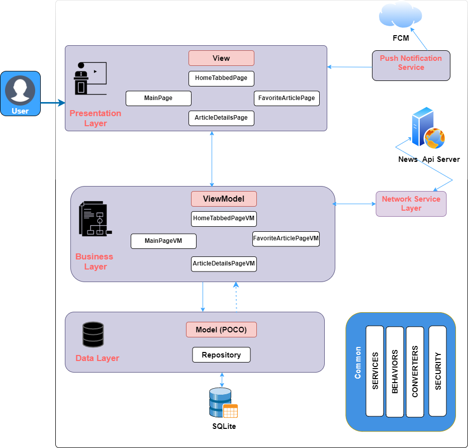
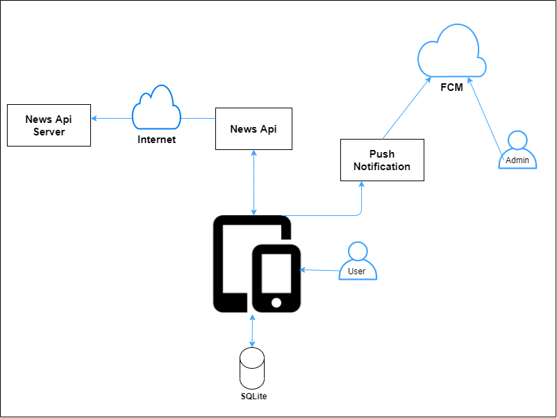
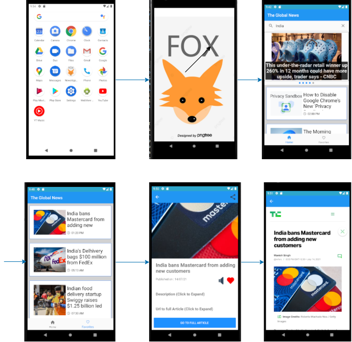
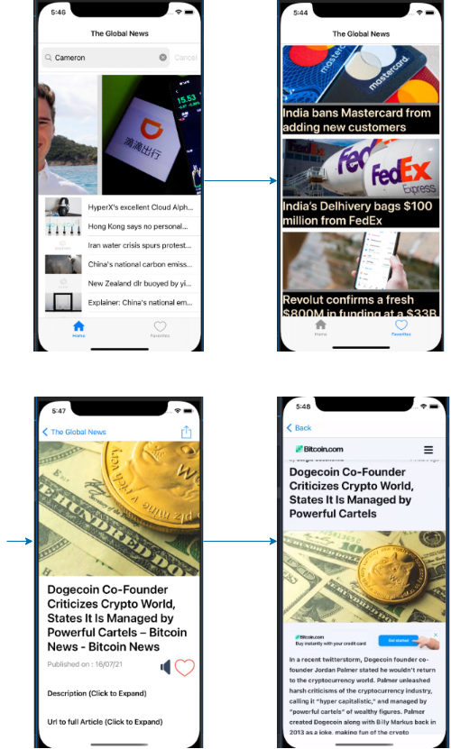

# News  Mobile Application 

## Scope of the Project
1. To create mobile application, with capability to search news from all over the world
2. Save favorite  news article to local SQLite database 
3. Infinite Scrolling of News Article in list 
4. Text to Speech feature ,as a accessibility feature  for News Article 
5. Share Feature to ,forward news article to different application
6. Push Notification for the News App using Firebase
7. Deep Linking the Application 
8. Create WebVIew for the full News Article 
   
## Layered  Architecture Design for Mobile App



1. for the application, we have used prism to implement the MVVM architectural pattern
+ for which we have here, 3 types of Classes
 1. View 
   + To present the data available at the DataContext to the end user to allow him to interact with it.
 2. ViewModel
   + To contain the logic that acts as a bridge between the View and the Model.
 3. Model 
   + To model a business object containing the required data.

2. The MVVM pattern provides the following benefits:
 + It helps to have a better Separation of concerns.
 + It allows to replace the View with a new one without changing the ViewModel.
 + It allows to easily unit test View's logic as now it is in a normal class (the ViewModel).
 + It allows graphics designers to work in the View without touching any logic.

## Mobile App Architecture Diagram



+ this diagram show the entities our application interacts with, i.e
  1. News Api 
   +  it the REST Api , we use to get the data for the application.
  2. SQLite
   + it our Mobile device local database, we use to store our saved article.
  3. Firebase 
   + here we are using firebase cloud for push notification service. 

## Features Added in Mobile Application 

1. **News Api Service**
  + **Nuget Package** 
  1. Newtonsoft.Json Package 
  + it is used to serialize and deserialize the data to and from api.
  + for this created a NewsApiClient Service class to get which handles the operation related to  api, 


```c#
 private ApiResponse MakeRequest(string endpoint, string querystring)
        {

            string url = $"{BASE_URL}{endpoint}?{querystring}&apiKey={API_KEY}";
            var json = new WebClient().DownloadString(url);

            ApiResponse apiResponse = null;


            if (!string.IsNullOrWhiteSpace(json))
            {
                // convert the json to an obj
                apiResponse = JsonConvert.DeserializeObject<ApiResponse>(json);


            }

            return apiResponse;

        }

```
  
2. **Save News Article to SQLite Database**
 + **Nuget Package** 
 1.  sqlite-net-pcl Nuget Package 
 + we have used Generic Repository pattern for all database related operation
 


3. **added Font icon** to the application
 + for this , we have added .otf files to our project, and set build type as Embedded Resource
 + added Helper FOntAwesomeIcons Class, containing a variable for each icon 
 as shown in the below snippet.


```c#
    public const string Home = "\uf015";

```

4.  **Text to Speech feature** , a accessibility feature  for News Article 
 + **Nuget Package** 
 1. Xamarin.Essentials Nuget Package.
 +  below code snippet shows ,how we used the feature


```c#

  private async Task SpeakNow()
 {
  var settings = new SpeechOptions()
                {
                    Volume = .75f,
                    Pitch = 1.0f
   };
   await TextToSpeech.SpeakAsync(ArticleDetails.Description, settings);
  } 

```
+ 
5. **Auto Scrolling** for items in Carosoul View
 +  for this feature, used TImer class from System namespace 
 +  using which we create scrolling at particular time interval
 <div style="page-break-after: always"></div>

```c#
 private void Timer_Elapsed(object sender, ElapsedEventArgs e)
        {
            Device.BeginInvokeOnMainThread(() =>
            {


                int count = (headlineCarousel.ItemsSource as ObservableCollection<Article>).Count;

                if(headlineCarousel.Position == (count - 1))
                {
                    headlineCarousel.Position = 0;
                }else
                {
                    headlineCarousel.Position += 1;

                }


            });
        }
```

6.  **Infinite Scrolling** of News Article in list 
 + first we added pagesize and page no to our api call, to limit 5 item per call and one page at a time
 + for this feature, we added a Behavior to ListView, which calls a LoadMore method
 + which gives call to the APi to load further data, i.e incremented page number.

7. **Push Notification** for the News App using Firebase
  + **Nuget Package**
  1. Xamarin.Firebase.Messaging 
  2. Xamarin.Firebase.lid
  3. Xamarin.Google.Dagger  
  4. Plugin.FirebasePushNotification Nuget Package 
 + added setup code in Android project for firebase 
 + now we can push notification to our app, for check we use the OnTokenRefresh Event to check if service is working
 <div style="page-break-after: always"></div>

```c#

CrossFirebasePushNotification.Current.OnTokenRefresh += Current_OnTokenRefresh;

 private void Current_OnTokenRefresh(object source, FirebasePushNotificationTokenEventArgs e)
        {
            System.Diagnostics.Debug.WriteLine($"Token : {e.Token}");
        }

```

8. used **Expander Control** in the application
 + **Nuget Package**
 1. Xamarin.CommunityToolkit Nuget Package
 + used Expander to hide and show data in UI on tap Gesture.

```xml
                  <xct:Expander>
                    <xct:Expander.Header>
                        <Label Text="Description (Click to Expand)"
                                   Padding="20"
                                   FontAttributes="Bold" 
                                   FontSize="Medium" />
                    </xct:Expander.Header>
                    <Grid Padding="10">


                        <Label Text="{Binding ArticleDetails.Description}" Padding="20,0,20,0" TextColor="Gray" />
                    </Grid>
                </xct:Expander>
```

9. **CachedImage Control** to laod large number of images 
 + **Nuget Package**
 1. Xamarin.FFImageLoading 
 2.  Xamarin.FFImageLoading.Forms Nuget Packages. 
 + We use this Library to load images quickly & easily
 + below is the code snippet for this plugin 
```xml
    <ffimageloading:CachedImage LoadingPlaceholder="placeholder2.png" Source="{Binding ArticleDetails.UrlToImage}" Aspect="AspectFill" HeightRequest="500" />

```            

10. **Deep Linking** the Application 
 + for Applying Deep Linking to our Application, 
 + we added Intent Filter to our MainActivity class

```c#

 [IntentFilter(new[] { Android.Content.Intent.ActionView },
                  DataScheme = "https",
                  DataHost = "xamboy.com",
                  DataPathPrefix = "/hello",
                  AutoVerify = true,
                  Categories = new[] { Android.Content.Intent.CategoryDefault, Android.Content.Intent.CategoryBrowsable })]
```
+ and handled the  OnAppLinkRequestReceived Method in App.xaml.cs class.
```c#
 protected override void OnAppLinkRequestReceived(Uri uri)
 {
     /// code to be shown after opening of our Application
 }
```
<div style="page-break-after: always"></div>

## Application Flow Diagram

###   In Android





<div style="page-break-after: always"></div>

### In iOS

